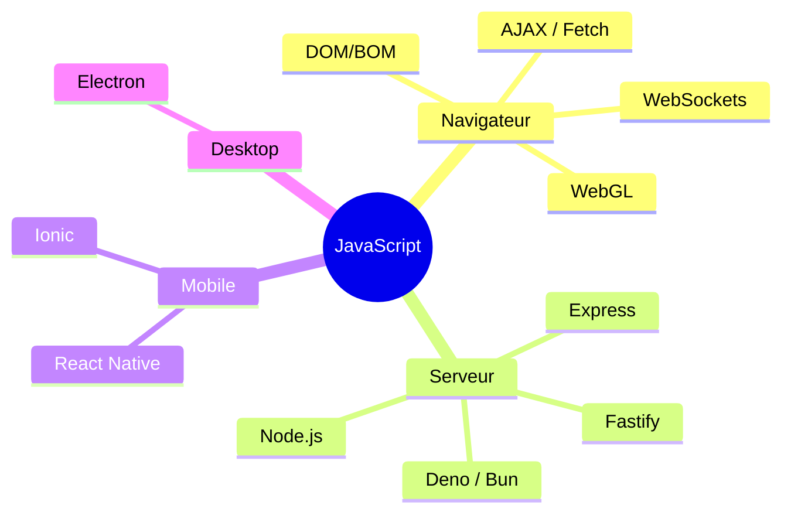
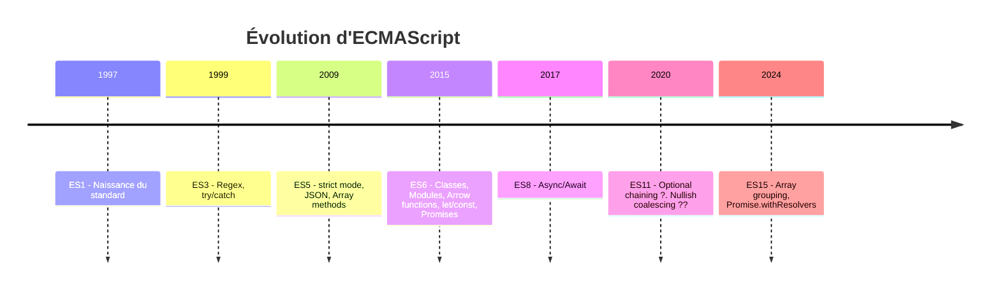
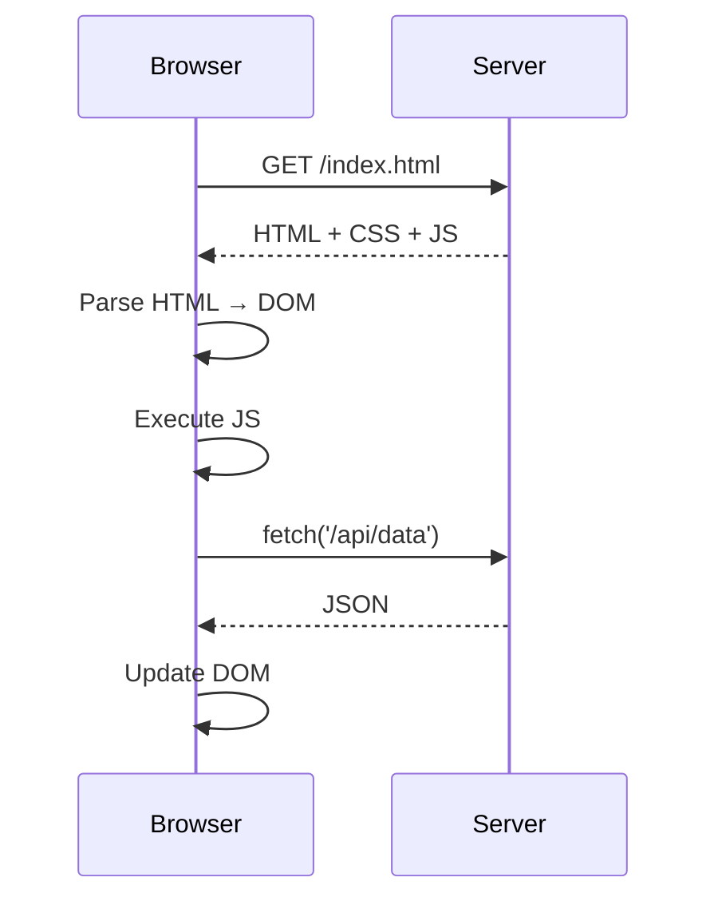
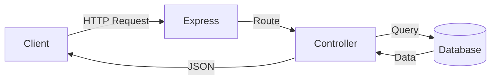

# JavaScript : Définition, Versions & Contexte

> **Feynman Technique** — Imagine explaining JavaScript to a 10-year-old: "It's the language that makes web pages _do things_. HTML is the skeleton, CSS is the clothes, JavaScript is the muscles and brain."

---

## 1. Qu'est-ce que JavaScript ?

JavaScript est un **langage de programmation interprété, orienté objet, et dynamique** initialement conçu pour rendre les pages web interactives. Aujourd'hui il s'exécute :

- **Côté client** — dans le navigateur (Chrome, Firefox, Safari…)
- **Côté serveur** — via Node.js (Express, Fastify…)
- **Mobile** — React Native, Ionic
- **Desktop** — Electron (VS Code, Discord…)
- **IoT** — Johnny-Five, Espruino



---

## 2. Histoire rapide

| Année | Événement |
|-------|-----------|
| 1995  | Brendan Eich crée JavaScript en **10 jours** pour Netscape Navigator |
| 1997  | Standardisation : **ECMAScript 1** (ECMA-262) |
| 2009  | Node.js — JS côté serveur (Ryan Dahl) |
| 2015  | **ES6 / ES2015** — révolution du langage (classes, arrow functions, modules…) |
| 2016+ | Versions annuelles ES2016, ES2017… jusqu'à ES2024 |



---

## 3. Versions ECMAScript

```
ES1  (1997)  — Standard initial
ES2  (1998)  — Alignement ISO
ES3  (1999)  — Regex, try/catch, switch
ES5  (2009)  — Strict mode, JSON, forEach/map/filter
ES6  (2015)  — let/const, classes, arrow fn, destructuring, modules, Promises
ES7  (2016)  — Array.includes(), exponentiation **
ES8  (2017)  — Async/Await, Object.entries/values
ES9  (2018)  — Rest/Spread operators, Promise.finally
ES10 (2019)  — Array.flat(), Object.fromEntries
ES11 (2020)  — Optional chaining ?., Nullish ??
ES12 (2021)  — Promise.any, String.replaceAll
ES13 (2022)  — Array.at(), Object.hasOwn, top-level await
ES14 (2023)  — Array findLast, toSorted, toReversed (immutable)
ES15 (2024)  — Promise.withResolvers, Object.groupBy
```

---

## 4. Contextes d'exécution

### Client Side (Navigateur)



### Server Side (Node.js)



### Moteurs JavaScript

| Moteur | Navigateur / Environnement |
|--------|---------------------------|
| **V8** | Chrome, Node.js, Deno |
| **SpiderMonkey** | Firefox |
| **JavaScriptCore** | Safari, Bun |
| **Chakra** | Edge (ancien) |

---

## 5. Challenges IT Domaine

### Challenge 1 — Facturation (Invoicing)
> **Contexte** : Une PME veut afficher une facture HTML interactive générée dynamiquement.

```javascript
// Données d'une facture
const invoice = {
  number: 'INV-2026-001',
  client: 'Alfa Computers SARL',
  date: new Date().toLocaleDateString('fr-FR'),
  items: [
    { description: 'Développement webapp', qty: 10, unitPrice: 150 },
    { description: 'Hébergement annuel',   qty: 1,  unitPrice: 500 },
  ],
  taxRate: 0.19
}

// Calculer le total HT
const subtotal = invoice.items.reduce((sum, item) => sum + item.qty * item.unitPrice, 0)
const tax = subtotal * invoice.taxRate
const total = subtotal + tax

console.log(`Facture ${invoice.number}`)
console.log(`Client   : ${invoice.client}`)
console.log(`Sous-total: ${subtotal.toFixed(2)} TND`)
console.log(`TVA 19%  : ${tax.toFixed(2)} TND`)
console.log(`Total TTC: ${total.toFixed(2)} TND`)
```

### Challenge 2 — Paie (Payroll)
> **Contexte** : Calculer le salaire net d'un employé selon les cotisations algériennes/tunisiennes.

```javascript
const employee = { name: 'Karim BENALI', grossSalary: 80000 }

// Cotisations sociales (taux simplifiés)
const CNSS_RATE     = 0.09   // 9% salarié
const IRPP_RATE     = 0.25   // IRG/IRPP simplifié

const cnss = employee.grossSalary * CNSS_RATE
const taxableBase = employee.grossSalary - cnss
const irpp = taxableBase * IRPP_RATE
const netSalary = employee.grossSalary - cnss - irpp

console.log(`Employé : ${employee.name}`)
console.log(`Salaire Brut : ${employee.grossSalary.toFixed(2)} DA`)
console.log(`CNSS (9%)    : -${cnss.toFixed(2)} DA`)
console.log(`IRG (25%)    : -${irpp.toFixed(2)} DA`)
console.log(`Salaire Net  : ${netSalary.toFixed(2)} DA`)
```

### Challenge 3 — Comptabilité (Accounting)
> **Contexte** : Vérifier l'équilibre d'un journal comptable (partie double).

```javascript
const journalEntries = [
  { account: '411 - Clients',        debit: 119000, credit: 0 },
  { account: '707 - Ventes',         debit: 0,      credit: 100000 },
  { account: '4457 - TVA collectée', debit: 0,      credit: 19000 },
]

const totalDebit  = journalEntries.reduce((s, e) => s + e.debit, 0)
const totalCredit = journalEntries.reduce((s, e) => s + e.credit, 0)
const isBalanced  = totalDebit === totalCredit

console.log(`Total Débit  : ${totalDebit.toFixed(2)}`)
console.log(`Total Crédit : ${totalCredit.toFixed(2)}`)
console.log(`Ecriture équilibrée : ${isBalanced ? '✅ OUI' : '❌ NON'}`)
```

---

## Résumé Feynman

| Concept | Analogie |
|---------|---------|
| JS côté client | Télécommande TV — vous contrôlez ce qui se passe sur l'écran |
| JS côté serveur (Node) | Cuisine du restaurant — le client ne voit pas mais c'est là que la magie se passe |
| ECMAScript | La recette officielle dont JS est la réalisation |
| V8 Engine | Le chef cuisinier qui lit la recette et prépare le plat |
