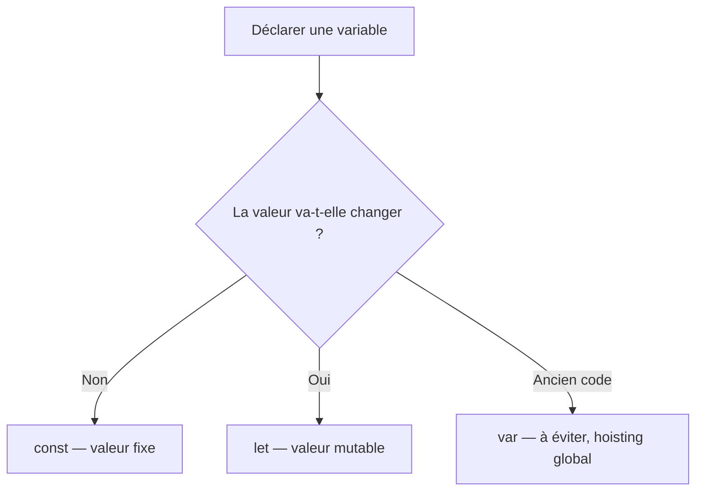
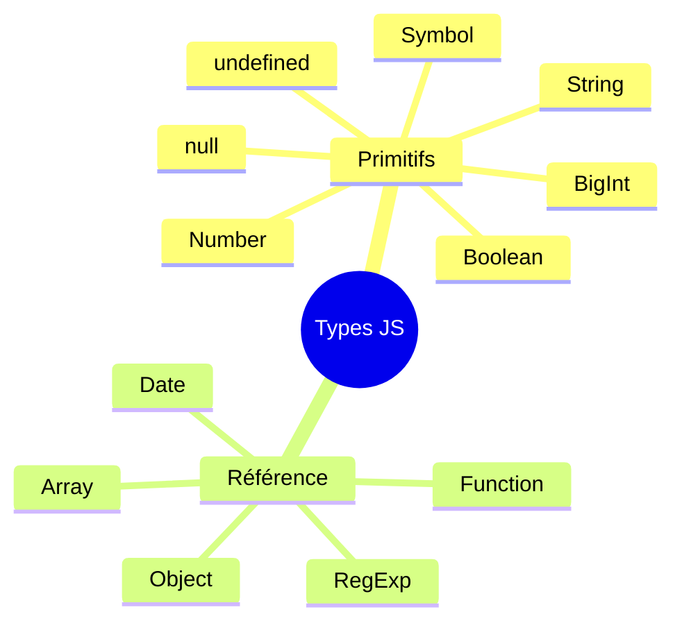

# JavaScript : Variables & Types Primitifs

> **Feynman Technique** — Une variable c'est comme une boîte étiquetée dans un entrepôt. `let quantity = 5` crée une boîte nommée "quantity" et y met le nombre 5. Le type est le genre de chose qu'on peut mettre dans la boîte.

---

## 1. Déclaration de variables

JavaScript offre trois mots-clés : `var`, `let`, `const`.



```javascript
const TAX_RATE = 0.19          // constante : ne change jamais
let   invoiceTotal = 0         // variable : sera recalculée
var   legacyCode = 'éviter'    // portée fonction (hoisté) → ❌ préférez let/const
```

### Portée (Scope)

| Mot-clé | Portée | Hoisting | Reassignable |
|---------|--------|----------|--------------|
| `var`   | Fonction | Oui (initialisé undefined) | Oui |
| `let`   | Bloc `{}` | Oui (TDZ) | Oui |
| `const` | Bloc `{}` | Oui (TDZ) | Non |

> TDZ = Temporal Dead Zone — accéder à `let`/`const` avant leur déclaration → `ReferenceError`

---

## 2. Types Primitifs

JavaScript possède **7 types primitifs** (immuables, passés par valeur) :



### String (chaîne de caractères)
```javascript
const name    = "Ferid HELALI"       // guillemets doubles
const company = 'Alfa Computers'      // guillemets simples
const message = `Bonjour ${name} !`  // template literals (ES6)

// Méthodes utiles
name.length         // 12
name.toUpperCase()  // "FERID HELALI"
name.includes('H')  // true
name.split(' ')     // ["Ferid", "HELALI"]
name.trim()         // supprime espaces début/fin
```

### Number
```javascript
const price    = 1500.50   // float
const quantity = 10        // integer
const rate     = 0.19

// Opérateurs
console.log(price * quantity)       // 15005
console.log(price.toFixed(2))       // "1500.50"
console.log(Number.isInteger(10))   // true
console.log(Math.round(1500.567))   // 1501
console.log(Number.MAX_SAFE_INTEGER) // 9007199254740991
```

### Boolean
```javascript
let isActive = true
let isPaid   = false

// Valeurs falsy : false, 0, "", null, undefined, NaN
// Valeurs truthy : tout le reste
if (invoiceAmount) {
  console.log('Facture non nulle')
}
```

### null et undefined
```javascript
let customer = null        // intentionnellement vide
let address               // déclaré mais non initialisé → undefined
console.log(typeof null)   // "object" (bug historique de JS !)
console.log(typeof address) // "undefined"
```

### Symbol (ES6)
```javascript
const id1 = Symbol('id')
const id2 = Symbol('id')
console.log(id1 === id2)  // false — chaque Symbol est unique
// Utilisé pour des clefs d'objet uniques (bibliothèques, métadonnées)
```

### BigInt (ES2020)
```javascript
const bigAmount = 9007199254740993n  // "n" suffix
console.log(bigAmount + 1n)          // 9007199254740994n
// Utile pour la comptabilité haute précision !
```

---

## 3. Opérateurs

```javascript
// Affectation
x = 5 ; x += 2 ; x -= 1 ; x *= 3 ; x /= 2 ; x %= 4 ; x **= 2

// Comparaison (toujours utiliser === et !==)
5 == "5"   // true  — comparaison laxiste (type coercion)
5 === "5"  // false — comparaison stricte ✓

// Logiques
true && false  // false
true || false  // true
!true          // false

// Ternaire
const label = isPaid ? 'Payée' : 'En attente'

// Nullish coalescing (ES2020)
const city = customer?.address?.city ?? 'Non renseigné'
```

### Typeof
```javascript
typeof "hello"     // "string"
typeof 42          // "number"
typeof true        // "boolean"
typeof undefined   // "undefined"
typeof null        // "object" ← bug historique
typeof {}          // "object"
typeof []          // "object"
typeof function(){} // "function"
```

---

## 4. Conversion de types

```javascript
// String → Number
Number("42")        // 42
parseInt("42px")    // 42
parseFloat("3.14")  // 3.14
+"42"               // 42  (unary +)

// Number → String
String(42)          // "42"
(42).toString()     // "42"
(1500).toFixed(2)   // "1500.00"

// Anything → Boolean
Boolean(0)          // false
Boolean("")         // false
Boolean(null)       // false
Boolean([])         // true  (attention !)
Boolean({})         // true  (attention !)
```

---

## 5. Challenges IT Domaine

### Challenge 1 — Facturation (Invoicing)
> Valider et formater les données d'une ligne de facture.

```javascript
function validateInvoiceLine(description, qty, unitPrice) {
  if (typeof description !== 'string' || description.trim() === '') {
    throw new TypeError('Description invalide')
  }
  if (typeof qty !== 'number' || qty <= 0 || !Number.isInteger(qty)) {
    throw new RangeError('Quantité doit être un entier positif')
  }
  if (typeof unitPrice !== 'number' || unitPrice < 0) {
    throw new RangeError('Prix unitaire invalide')
  }
  return {
    description: description.trim(),
    qty,
    unitPrice,
    total: +(qty * unitPrice).toFixed(2)
  }
}

const line = validateInvoiceLine('Maintenance logiciel', 3, 250)
console.log(line) // { description: 'Maintenance logiciel', qty: 3, unitPrice: 250, total: 750 }
```

### Challenge 2 — Paie (Payroll)
> Détecter le type de contrat à partir d'une chaîne saisie par l'utilisateur.

```javascript
function parseContractType(input) {
  const normalized = String(input).trim().toUpperCase()
  const TYPES = { CDI: 'Contrat à Durée Indéterminée', CDD: 'Contrat à Durée Déterminée', INTERIM: 'Mission Intérim' }
  return TYPES[normalized] ?? 'Type inconnu'
}

console.log(parseContractType('  cdi  '))    // "Contrat à Durée Indéterminée"
console.log(parseContractType('interim'))    // "Mission Intérim"
console.log(parseContractType('stagiaire'))  // "Type inconnu"
```

### Challenge 3 — Comptabilité (Accounting)
> Calculer un indicateur financier en gérant les cas limites de types.

```javascript
function calculateCurrentRatio(currentAssets, currentLiabilities) {
  if (typeof currentAssets !== 'number' || typeof currentLiabilities !== 'number') {
    throw new TypeError('Les actifs et passifs doivent être des nombres')
  }
  if (currentLiabilities === 0) return null  // division par zéro
  const ratio = currentAssets / currentLiabilities
  return {
    ratio: +ratio.toFixed(2),
    interpretation: ratio >= 2 ? 'Excellente liquidité' : ratio >= 1 ? 'Liquidité correcte' : 'Risque de liquidité'
  }
}

console.log(calculateCurrentRatio(500000, 200000))
// { ratio: 2.5, interpretation: 'Excellente liquidité' }
```

---

## Résumé Feynman

| Concept | Analogie |
|---------|---------|
| `const` | Tatouage — permanent |
| `let` | Tableau blanc — effaçable |
| `var` | Post-it collé au mur de toute la pièce — visible partout |
| Type primitif | Valeur copiée comme un photocopie |
| Type référence | Clé d'un casier — plusieurs personnes peuvent accéder au même objet |
