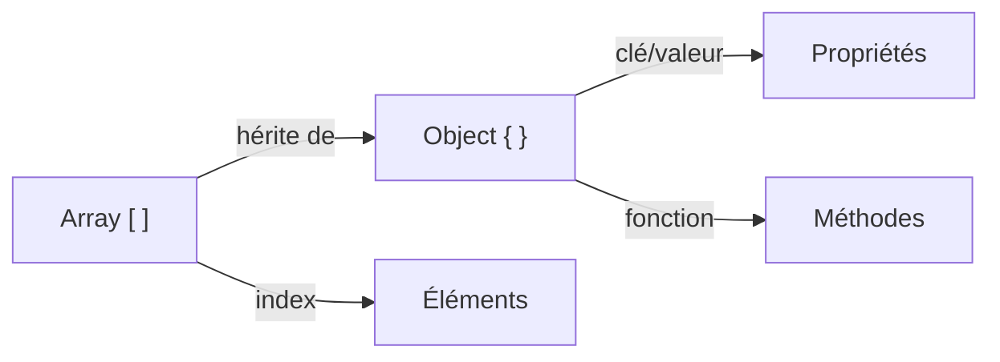
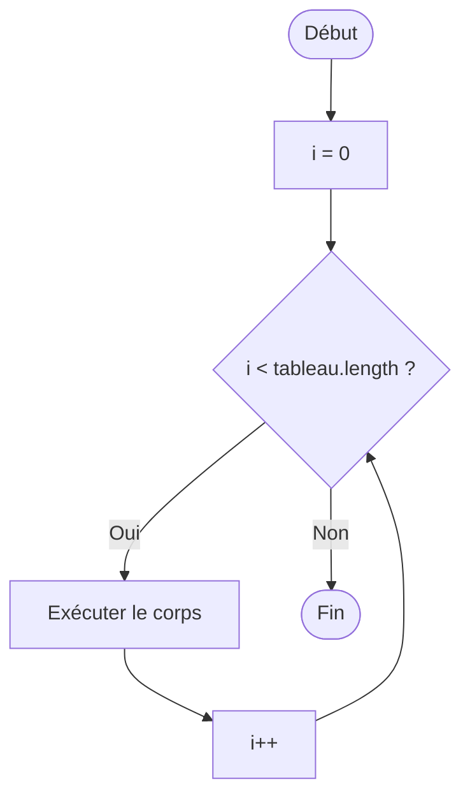

# JavaScript : Structures de Données & Transfert de Contrôle

> **Feynman Technique** — Un tableau `[]` c'est une liste numérotée. Un objet `{}` c'est un carnet d'adresses avec des étiquettes. Le `if/else` c'est un carrefour avec des feux. La boucle `for` c'est un tapis roulant qui tourne jusqu'à ce qu'on l'arrête.

---

## 1. Structures de Données

### Arrays (Tableaux)

```javascript
const employees = ['Karim', 'Amira', 'Sami']

// Accès
employees[0]          // 'Karim'
employees.at(-1)      // 'Sami' (ES2022)
employees.length      // 3

// Mutation
employees.push('Nadia')       // ajoute en fin
employees.pop()               // retire le dernier
employees.unshift('Boss')     // ajoute en début
employees.shift()             // retire le premier
employees.splice(1, 1)        // retire 1 élément à l'index 1

// Itération fonctionnelle
employees.forEach(e => console.log(e))
const upper = employees.map(e => e.toUpperCase())
const k = employees.filter(e => e.startsWith('K'))
const joined = employees.join(', ')
const found = employees.find(e => e === 'Sami')
const idx = employees.findIndex(e => e === 'Sami')
const exists = employees.includes('Karim')  // true

// Transformation
const sorted = [...employees].sort()                  // copie + tri
const reversed = [...employees].reverse()             // copie + inversion
const flat = [[1,2],[3,4]].flat()                    // [1,2,3,4]
const groups = employees.reduce((acc, e) => { /*...*/ }, {})
```

### Objets

```javascript
const invoice = {
  id: 'INV-001',
  client: 'Alfa Computers',
  total: 15000,
  isPaid: false,
  address: { city: 'Alger', country: 'Algérie' }
}

// Accès
invoice.id               // dot notation
invoice['client']        // bracket notation (dynamique)
invoice.address.city     // imbriqué
invoice?.address?.zip    // optional chaining → undefined si manquant

// Modification
invoice.isPaid = true
invoice.discount = 0.10  // ajout de propriété

// Destructuring (ES6)
const { id, client, total } = invoice
const { address: { city } } = invoice  // imbriqué

// Spread / Rest
const updatedInvoice = { ...invoice, total: 16000 }  // copie + modification
const { id: _, ...withoutId } = invoice              // exclure une propriété

// Méthodes utiles
Object.keys(invoice)          // ['id', 'client', 'total', ...]
Object.values(invoice)        // ['INV-001', 'Alfa Computers', ...]
Object.entries(invoice)       // [['id', 'INV-001'], ...]
Object.assign({}, invoice, { discount: 5 })  // merge
Object.freeze(invoice)        // rend immuable
```



---

## 2. Transfert de Contrôle

### Conditionnelles

```javascript
// if / else if / else
const grade = 75
if (grade >= 90)      console.log('Excellent')
else if (grade >= 70) console.log('Bien')
else if (grade >= 50) console.log('Passable')
else                  console.log('Insuffisant')

// switch
const status = 'PENDING'
switch (status) {
  case 'PAID':    console.log('Payée');     break
  case 'PENDING': console.log('En attente'); break
  case 'OVERDUE': console.log('En retard');  break
  default:        console.log('Inconnu')
}

// Ternaire
const label = status === 'PAID' ? '✅ Payée' : '⏳ En attente'

// Nullish coalescing
const discount = invoice.discount ?? 0
```

### Boucles

```javascript
// for classique
for (let i = 0; i < 10; i++) { /* ... */ }

// for...of — itère sur les valeurs
for (const item of items) { console.log(item) }

// for...in — itère sur les clefs d'objet
for (const key in invoice) { console.log(key, invoice[key]) }

// while
let attempt = 0
while (attempt < 3) { attempt++ }

// do...while (toujours exécuté au moins une fois)
do { /* saisie utilisateur */ } while (!isValid)

// Array methods (préférable aux boucles for)
items.forEach(i => ...)
items.map(i => ...)
items.filter(i => ...)
items.reduce((acc, i) => ..., initial)
items.some(i => ...)    // au moins un
items.every(i => ...)   // tous
```



### Déstructuration avancée

```javascript
// Array destructuring
const [first, second, ...rest] = [10, 20, 30, 40]
// first=10, second=20, rest=[30,40]

// Object destructuring avec renommage et valeur par défaut
const { name: clientName = 'Anonyme', total: amount = 0 } = invoice

// Dans les paramètres de fonction
function printInvoice({ id, client, total, isPaid = false }) {
  console.log(`${id} — ${client} — ${total} TND — ${isPaid ? 'Payée' : 'Non payée'}`)
}
```

---

## 3. Map et Set

```javascript
// Map — clef peut être n'importe quel type
const accountMap = new Map()
accountMap.set('411', 'Clients')
accountMap.set('607', 'Achats')
accountMap.get('411')          // 'Clients'
accountMap.has('999')          // false
accountMap.size                // 2

// Set — valeurs uniques
const invoiceNums = new Set(['INV-001', 'INV-002', 'INV-001'])
invoiceNums.size               // 2 (doublon ignoré)
invoiceNums.has('INV-001')     // true
[...invoiceNums]               // ['INV-001', 'INV-002']

// Dédoublonnage rapide
const unique = [...new Set(array)]
```

---

## 4. Challenges IT Domaine

### Challenge 1 — Facturation (Invoicing)
> Générer un tableau récapitulatif de factures filtrées et triées.

```javascript
const invoices = [
  { id: 'INV-001', client: 'Alfa',    total: 15000, status: 'PAID' },
  { id: 'INV-002', client: 'Beta',    total: 8500,  status: 'PENDING' },
  { id: 'INV-003', client: 'Gamma',   total: 22000, status: 'OVERDUE' },
  { id: 'INV-004', client: 'Delta',   total: 5000,  status: 'PAID' },
]

const unpaid = invoices
  .filter(inv => inv.status !== 'PAID')
  .sort((a, b) => b.total - a.total)

const totalUnpaid = unpaid.reduce((sum, inv) => sum + inv.total, 0)

console.log('Factures impayées (plus importantes d\'abord):')
unpaid.forEach(inv => console.log(`  ${inv.id} — ${inv.client}: ${inv.total} TND [${inv.status}]`))
console.log(`Total impayé: ${totalUnpaid.toFixed(2)} TND`)
```

### Challenge 2 — Paie (Payroll)
> Classer les employés par tranche de salaire avec reduce.

```javascript
const staff = [
  { name: 'Ali',   salary: 45000 },
  { name: 'Sara',  salary: 72000 },
  { name: 'Mehdi', salary: 90000 },
  { name: 'Leila', salary: 38000 },
  { name: 'Omar',  salary: 68000 },
]

const brackets = staff.reduce((acc, emp) => {
  const key = emp.salary < 50000 ? 'Junior (<50k)' 
            : emp.salary < 80000 ? 'Senior (50k-80k)' 
            : 'Expert (>80k)'
  acc[key] = acc[key] ? [...acc[key], emp.name] : [emp.name]
  return acc
}, {})

console.log(brackets)
// { 'Junior (<50k)': ['Ali', 'Leila'], 'Senior (50k-80k)': ['Sara', 'Omar'], 'Expert (>80k)': ['Mehdi'] }
```

### Challenge 3 — Comptabilité (Accounting)
> Construire un grand-livre simplifié (regroupement par compte) avec Map.

```javascript
const journal = [
  { account: '411', label: 'Clients',        debit: 119000, credit: 0 },
  { account: '707', label: 'Ventes',         debit: 0,      credit: 100000 },
  { account: '4457', label: 'TVA collectée', debit: 0,      credit: 19000 },
  { account: '411', label: 'Règlement',      debit: 0,      credit: 119000 },
  { account: '512', label: 'Banque',         debit: 119000, credit: 0 },
]

const ledger = new Map()
for (const entry of journal) {
  const current = ledger.get(entry.account) ?? { label: entry.label, debit: 0, credit: 0 }
  ledger.set(entry.account, {
    ...current,
    debit:  current.debit  + entry.debit,
    credit: current.credit + entry.credit,
  })
}

console.log('=== Grand Livre ===')
for (const [account, { label, debit, credit }] of ledger) {
  const balance = debit - credit
  console.log(`${account} — ${label}: D=${debit} C=${credit} Solde=${balance >= 0 ? 'D' : 'C'}${Math.abs(balance)}`)
}
```

---

## Résumé Feynman

| Concept | Analogie |
|---------|---------|
| Array | Liste de courses numérotée |
| Object | Fiche client avec nom, prénom, téléphone… |
| Map | Dictionnaire bilingue (n'importe quelle clef) |
| Set | Sac de billes sans doublons |
| `for...of` | Lire chaque page d'un livre dans l'ordre |
| `for...in` | Lire chaque en-tête de chapitre |
| `reduce` | Plier une liste en un seul résultat (total, objet, string…) |
