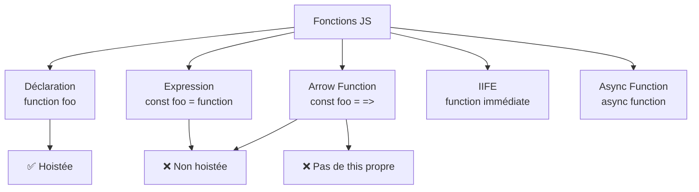
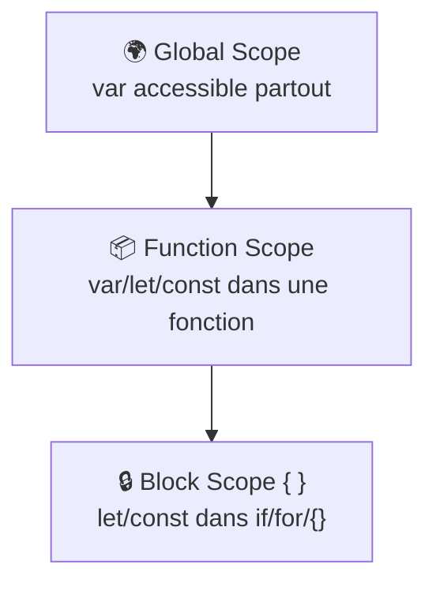

# JavaScript : Fonctions (I, II, III)

> **Feynman Technique** — Une fonction c'est comme une machine à café. Tu mets des ingrédients (arguments), la machine fait son travail (corps de la fonction), et tu reçois un café (valeur de retour). Tu peux utiliser la même machine à café autant de fois que tu veux.

---

## PARTIE I — Fondamentaux

### 1.1 Définition et types de fonctions

```javascript
// 1. Déclaration de fonction (hoistée)
function add(a, b) {
  return a + b
}

// 2. Expression de fonction
const multiply = function(a, b) {
  return a * b
}

// 3. Arrow function (ES6) — syntaxe concise, pas de this propre
const subtract = (a, b) => a - b                   // corps unique → return implicite
const square = n => n * n                           // un seul param → sans parenthèses
const greet = () => 'Hello !'                      // sans param
const divide = (a, b) => {
  if (b === 0) throw new Error('Division par zéro')
  return a / b
}

// 4. Fonction nommée (utile pour la récursion et le débogage)
const factorial = function fact(n) {
  return n <= 1 ? 1 : n * fact(n - 1)
}

// 5. IIFE — Immediately Invoked Function Expression
const config = (function() {
  const API_URL = 'https://api.example.com'
  return { API_URL }
})()
```



### 1.2 Paramètres

```javascript
// Valeurs par défaut (ES6)
function createInvoice(client, total, currency = 'TND', taxRate = 0.19) {
  return { client, total, currency, tax: total * taxRate }
}

// Rest parameters — capture le reste en tableau
function sum(...numbers) {
  return numbers.reduce((acc, n) => acc + n, 0)
}
sum(10, 20, 30, 40)  // 100

// Arguments object (fonctions classiques uniquement)
function legacy() {
  console.log(arguments[0])  // pas disponible dans arrow functions
}

// Déstructuration dans les paramètres
function printEmployee({ name, salary, department = 'Général' }) {
  return `${name} — ${department}: ${salary} DA`
}
```

---

## PARTIE II — Portée, Closures & Hoisting

### 2.1 Portée (Scope)



```javascript
const globalTax = 0.19  // global

function calculateNet(gross) {
  const localDiscount = 0.05  // local à la fonction
  if (gross > 100000) {
    let bonusRate = 0.10      // local au bloc if
    return gross * (1 - localDiscount - globalTax + bonusRate)
  }
  // bonusRate n'existe pas ici → ReferenceError
  return gross * (1 - localDiscount - globalTax)
}
```

### 2.2 Hoisting

```javascript
// Hoisting des déclarations de fonctions → appelable avant la définition
greet()  // ✅ "Hello" — fonctionne grâce au hoisting

function greet() { console.log('Hello') }

// var est hoistée mais initialisée à undefined
console.log(x)  // undefined (pas d'erreur)
var x = 5

// let/const → Temporal Dead Zone
console.log(y)  // ❌ ReferenceError
let y = 10
```

### 2.3 Closures

> Une **closure** est une fonction qui "mémorise" l'environnement dans lequel elle a été créée, même après que cet environnement n'existe plus.

```javascript
// Compteur privé — pattern classique de closure
function createCounter(start = 0) {
  let count = start  // variable privée — inaccessible depuis l'extérieur
  return {
    increment: () => ++count,
    decrement: () => --count,
    value:     () => count,
    reset:     () => { count = start }
  }
}

const invoiceCounter = createCounter(1000)
invoiceCounter.increment()  // 1001
invoiceCounter.increment()  // 1002
console.log(invoiceCounter.value())  // 1002

// Closure pour configuration
function createTaxCalculator(rate) {
  return function(amount) {
    return { net: amount, tax: amount * rate, total: amount * (1 + rate) }
  }
}

const calcTVA19 = createTaxCalculator(0.19)
const calcTVA09 = createTaxCalculator(0.09)

console.log(calcTVA19(10000))  // { net: 10000, tax: 1900, total: 11900 }
console.log(calcTVA09(10000))  // { net: 10000, tax: 900, total: 10900 }
```

---

## PARTIE III — Fonctions d'Ordre Supérieur

### 3.1 Higher-Order Functions

> Une **fonction d'ordre supérieur** prend une fonction en argument et/ou retourne une fonction.

```javascript
// map — transforme chaque élément
const prices = [100, 200, 300]
const withTax = prices.map(p => p * 1.19)  // [119, 238, 357]

// filter — garde les éléments qui passent le test
const expensive = prices.filter(p => p >= 200)  // [200, 300]

// reduce — agrège tout en un résultat
const total = prices.reduce((sum, p) => sum + p, 0)  // 600

// Chaînage fonctionnel
const result = invoices
  .filter(inv => inv.status === 'PAID')
  .map(inv => ({ ...inv, netTotal: inv.total / 1.19 }))
  .reduce((sum, inv) => sum + inv.netTotal, 0)
```

### 3.2 Currying

> Le **currying** transforme une fonction à N arguments en une séquence de fonctions à 1 argument.

```javascript
// Currying manuel
const multiply = a => b => a * b
const double = multiply(2)
const triple = multiply(3)

double(5)  // 10
triple(5)  // 15

// Cas réel : créer des formatters configurables
const formatCurrency = (currency) => (amount) =>
  new Intl.NumberFormat('fr-DZ', { style: 'currency', currency }).format(amount)

const formatTND = formatCurrency('TND')
const formatEUR = formatCurrency('EUR')

console.log(formatTND(15000))  // "15 000,00 DT"
console.log(formatEUR(150))    // "150,00 €"
```

### 3.3 Mémoïsation (Memoization)

```javascript
// Cache les résultats d'une fonction coûteuse
function memoize(fn) {
  const cache = new Map()
  return function(...args) {
    const key = JSON.stringify(args)
    if (cache.has(key)) return cache.get(key)
    const result = fn.apply(this, args)
    cache.set(key, result)
    return result
  }
}

// Calcul de TVA récupéré depuis cache
const memoTax = memoize((amount, rate) => amount * rate)
memoTax(100000, 0.19)  // calculé
memoTax(100000, 0.19)  // depuis cache
```

### 3.4 Composition de fonctions

```javascript
const compose = (...fns) => x => fns.reduceRight((acc, fn) => fn(acc), x)
const pipe    = (...fns) => x => fns.reduce((acc, fn) => fn(acc), x)

const roundTwo = n => Math.round(n * 100) / 100
const addTax   = n => n * 1.19
const applyDiscount = pct => n => n * (1 - pct)

// Pipeline de calcul de prix
const finalPrice = pipe(
  applyDiscount(0.10),  // -10%
  addTax,               // +19% TVA
  roundTwo              // arrondi 2 décimales
)

console.log(finalPrice(100000))  // 107100
```

---

## 5. Challenges IT Domaine

### Challenge 1 — Facturation (Invoicing)
> Générer des numéros de facture séquentiels avec closure.

```javascript
function invoiceNumberGenerator(prefix = 'INV', year = new Date().getFullYear()) {
  let sequence = 0
  return () => {
    sequence++
    return `${prefix}-${year}-${String(sequence).padStart(4, '0')}`
  }
}

const nextInvoice = invoiceNumberGenerator()
console.log(nextInvoice())  // INV-2026-0001
console.log(nextInvoice())  // INV-2026-0002
console.log(nextInvoice())  // INV-2026-0003
```

### Challenge 2 — Paie (Payroll)
> Calculer la grille de salaires avec composition.

```javascript
const applyBonus      = pct => salary => salary * (1 + pct)
const deductCNSS      = rate => salary => salary * (1 - rate)
const roundSalary     = salary => Math.round(salary)

const netSalaryPipeline = (bonusPct, cnssRate) =>
  pipe(applyBonus(bonusPct), deductCNSS(cnssRate), roundSalary)

const seniorNet = netSalaryPipeline(0.20, 0.09)  // +20% bonus, -9% CNSS
console.log(seniorNet(80000))  // 87360
```

### Challenge 3 — Comptabilité (Accounting)
> Mémoïser le calcul d'amortissement (souvent répété pour plusieurs biens).

```javascript
const calcAmortissement = memoize((cost, salvage, lifeYears) => {
  const annual = (cost - salvage) / lifeYears
  return Array.from({ length: lifeYears }, (_, i) => ({
    year: i + 1,
    annualDepreciation: annual,
    bookValue: cost - annual * (i + 1)
  }))
})

const schedule = calcAmortissement(100000, 10000, 5)
console.table(schedule)
```

---

## Résumé Feynman

| Concept | Analogie |
|---------|---------|
| Closure | Un sac à dos que la fonction emporte partout avec ses variables locales |
| Currying | Une machine à café réglable : d'abord tu choisis l'intensité, ensuite la quantité |
| Higher-Order Function | Un chef d'orchestre qui dit à chaque musicien quoi jouer (la fonction passée) |
| Memoization | Un étudiant qui note les réponses déjà calculées pour ne pas recalculer |
| Composition | Une chaîne de montage : chaque fonction est une station d'usinage |
