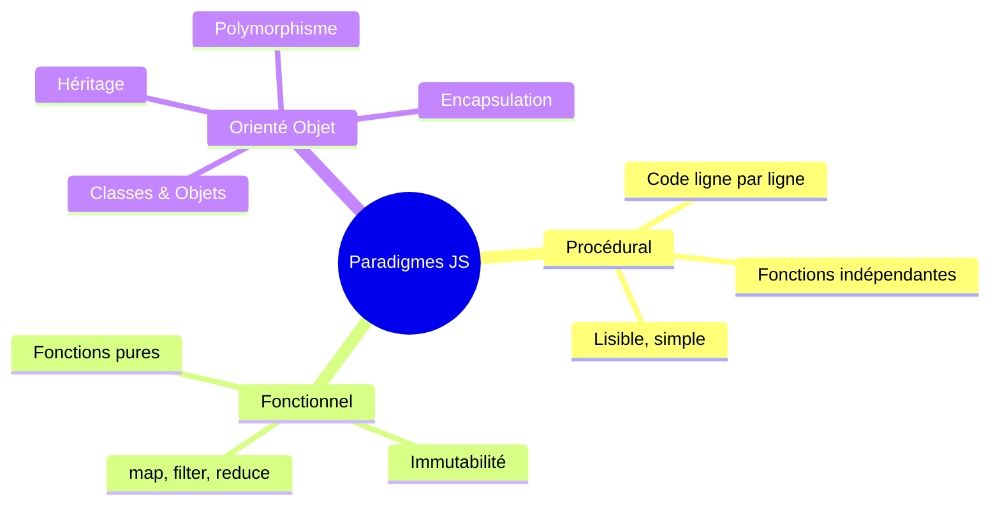
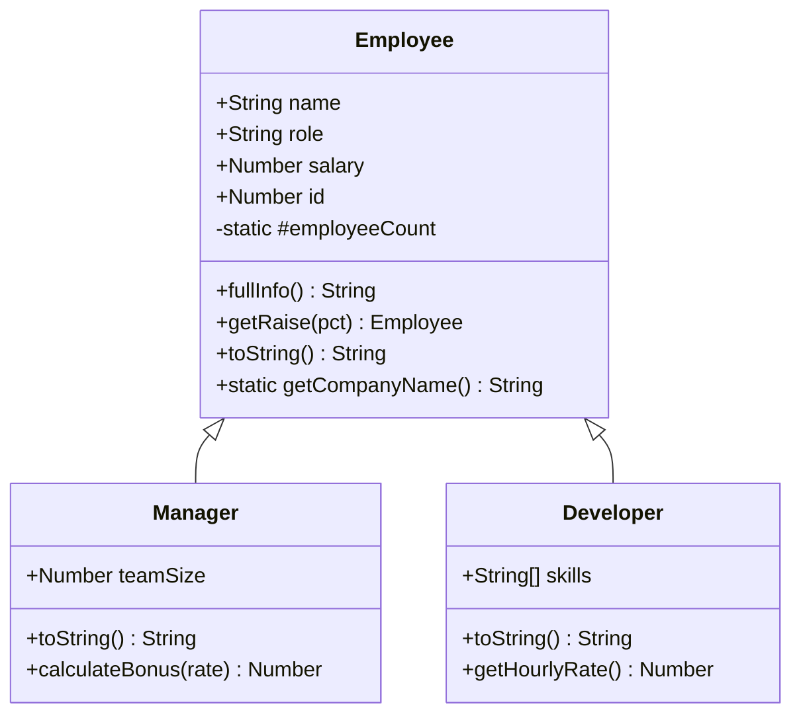
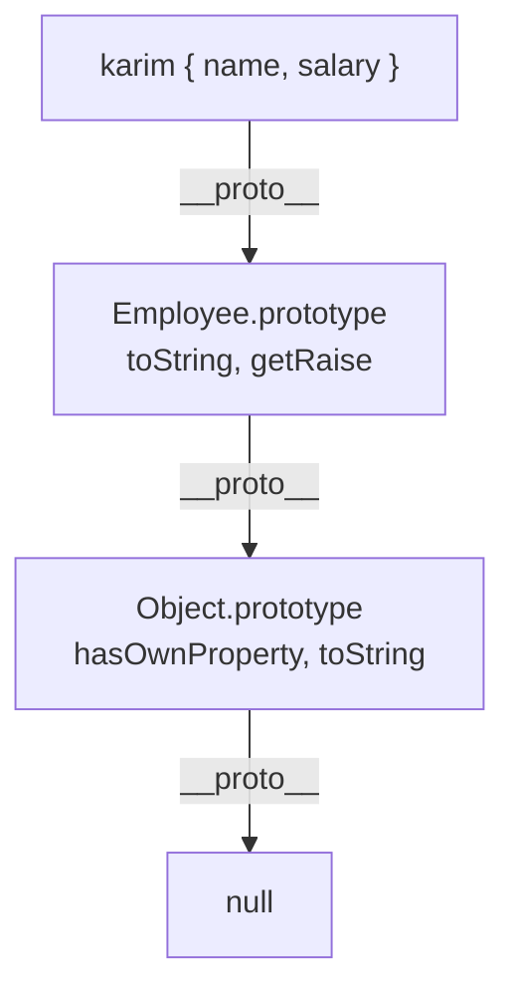

# JavaScript : Programmation Orientée Objet (POO)

> **Feynman Technique** — La POO c'est comme construire une ville avec des plans d'architecte. La **classe** est le plan (blueprint). L'**objet** est le bâtiment construit à partir de ce plan. Tu peux construire 1000 bâtiments différents avec le même plan mais chacun aura ses propres habitants (données).

---

## 1. Les Paradigmes de Programmation



JavaScript supporte les **trois paradigmes** simultanément — c'est sa force et sa complexité.

---

## 2. Classes ES6

```javascript
class Employee {
  // Propriétés de classe (static)
  static companyName = 'Alfa Computers'
  static #employeeCount = 0  // privé (ES2022)

  // Constructeur
  constructor(name, role, salary) {
    this.name   = name
    this.role   = role
    this.salary = salary
    this.id     = ++Employee.#employeeCount
  }

  // Getters / Setters
  get fullInfo() {
    return `[${this.id}] ${this.name} — ${this.role}`
  }

  set salary(value) {
    if (value < 0) throw new RangeError('Salaire ne peut être négatif')
    this._salary = value
  }
  get salary() { return this._salary }

  // Méthodes d'instance
  getRaise(percent) {
    return new Employee(this.name, this.role, this.salary * (1 + percent))
  }

  toString() {
    return `${this.fullInfo} — ${this.salary.toFixed(2)} DA`
  }

  // Méthode statique
  static getCompanyName() {
    return Employee.companyName
  }
}

const karim = new Employee('Karim BENALI', 'Développeur Senior', 90000)
console.log(karim.toString())           // [1] Karim BENALI — Développeur Senior — 90000.00 DA
console.log(Employee.getCompanyName())  // Alfa Computers
```

---

## 3. Héritage (extends)

```javascript
class Manager extends Employee {
  constructor(name, salary, teamSize) {
    super(name, 'Manager', salary)  // ← obligatoire avant this
    this.teamSize = teamSize
  }

  // Override (polymorphisme)
  toString() {
    return `${super.toString()} | Équipe: ${this.teamSize} personnes`
  }

  // Méthode spécifique
  calculateBonus(performanceRate) {
    return this.salary * performanceRate * (1 + this.teamSize * 0.01)
  }
}

const sara = new Manager('Sara KHELIL', 120000, 8)
console.log(sara.toString())              // [2] Sara KHELIL — Manager — 120000.00 DA | Équipe: 8 personnes
console.log(sara.calculateBonus(0.15))    // 21600
console.log(sara instanceof Manager)      // true
console.log(sara instanceof Employee)     // true ← héritage
```



---

## 4. Encapsulation & Propriétés Privées

```javascript
class BankAccount {
  #balance = 0         // champ privé (ES2022)
  #transactions = []

  constructor(owner, initialBalance = 0) {
    this.owner = owner
    this.#balance = initialBalance
  }

  deposit(amount) {
    if (amount <= 0) throw new RangeError('Montant invalide')
    this.#balance += amount
    this.#transactions.push({ type: 'credit', amount, date: new Date() })
    return this
  }

  withdraw(amount) {
    if (amount > this.#balance) throw new Error('Solde insuffisant')
    this.#balance -= amount
    this.#transactions.push({ type: 'debit', amount, date: new Date() })
    return this
  }

  get balance() { return this.#balance }
  get statement() { return [...this.#transactions] }  // copie défensive
}

const account = new BankAccount('Alfa Computers', 100000)
account.deposit(50000).withdraw(20000)    // chainable
console.log(account.balance)              // 130000
// account.#balance  → SyntaxError (privé)
```

---

## 5. Prototype Chain



```javascript
// Toutes les instances partagent le prototype
console.log(karim.__proto__ === Employee.prototype)  // true
console.log(Employee.prototype.__proto__ === Object.prototype)  // true

// Vérifications
karim.hasOwnProperty('name')   // true
karim.hasOwnProperty('toString')  // false (sur le prototype)
Object.getPrototypeOf(karim) === Employee.prototype  // true
```

---

## 6. Mixins (Composition over Inheritance)

```javascript
// Mixin — comportements réutilisables sans héritage multiple
const Serializable = (superclass) => class extends superclass {
  toJSON() { return JSON.stringify(this) }
  static fromJSON(json) { return Object.assign(new this(), JSON.parse(json)) }
}

const Timestamped = (superclass) => class extends superclass {
  constructor(...args) {
    super(...args)
    this.createdAt = new Date()
    this.updatedAt = new Date()
  }
  touch() { this.updatedAt = new Date(); return this }
}

class Document extends Timestamped(Serializable(Employee)) {
  constructor(name, role, salary, docType) {
    super(name, role, salary)
    this.docType = docType
  }
}
```

---

## 7. Challenges IT Domaine

### Challenge 1 — Facturation (Invoicing)
> Modéliser une facture avec ses lignes en POO.

```javascript
class InvoiceLine {
  constructor(description, qty, unitPrice) {
    this.description = description
    this.qty = qty
    this.unitPrice = unitPrice
  }
  get total() { return this.qty * this.unitPrice }
}

class Invoice {
  static #sequence = 1000
  #lines = []

  constructor(client, taxRate = 0.19) {
    this.id = `INV-2026-${++Invoice.#sequence}`
    this.client = client
    this.taxRate = taxRate
    this.date = new Date()
    this.status = 'PENDING'
  }

  addLine(description, qty, unitPrice) {
    this.#lines.push(new InvoiceLine(description, qty, unitPrice))
    return this
  }

  get subtotal() { return this.#lines.reduce((s, l) => s + l.total, 0) }
  get tax()      { return this.subtotal * this.taxRate }
  get total()    { return this.subtotal + this.tax }
  get lines()    { return [...this.#lines] }

  pay() { this.status = 'PAID'; return this }

  toString() {
    return [
      `=== ${this.id} — ${this.client} ===`,
      ...this.lines.map(l => `  ${l.description}: ${l.qty} × ${l.unitPrice} = ${l.total}`),
      `Sous-total : ${this.subtotal.toFixed(2)} TND`,
      `TVA (${this.taxRate * 100}%) : ${this.tax.toFixed(2)} TND`,
      `TOTAL      : ${this.total.toFixed(2)} TND`,
      `Statut     : ${this.status}`
    ].join('\n')
  }
}

const inv = new Invoice('Alfa Computers')
  .addLine('Développement webapp', 10, 200)
  .addLine('Hébergement annuel', 1, 500)
  .pay()

console.log(inv.toString())
```

### Challenge 2 — Paie (Payroll)
> Hiérarchie d'employés avec calcul de salaire net polymorphique.

```javascript
class StaffMember {
  constructor(name, contractType) { this.name = name; this.contractType = contractType }
  calculateNet() { throw new Error('Méthode abstraite') }
}

class FullTimeEmployee extends StaffMember {
  constructor(name, grossSalary) {
    super(name, 'CDI')
    this.grossSalary = grossSalary
  }
  calculateNet() { return this.grossSalary * (1 - 0.09) * (1 - 0.25) }
}

class Contractor extends StaffMember {
  constructor(name, dailyRate, daysWorked) {
    super(name, 'FREELANCE')
    this.grossAmount = dailyRate * daysWorked
  }
  calculateNet() { return this.grossAmount * 0.75 }  // retenue à la source 25%
}

const team = [
  new FullTimeEmployee('Karim', 90000),
  new Contractor('Sami', 5000, 15)
]

team.forEach(m => console.log(`${m.name} (${m.contractType}): ${m.calculateNet().toFixed(2)} DA net`))
```

### Challenge 3 — Comptabilité (Accounting)
> Compte comptable avec journal de mouvements.

```javascript
class Account {
  #entries = []

  constructor(number, label, type) {
    this.number = number
    this.label = label
    this.type = type  // 'asset' | 'liability' | 'equity' | 'revenue' | 'expense'
  }

  debit(amount, description) {
    this.#entries.push({ type: 'D', amount, description, date: new Date() })
    return this
  }

  credit(amount, description) {
    this.#entries.push({ type: 'C', amount, description, date: new Date() })
    return this
  }

  get totalDebits()  { return this.#entries.filter(e => e.type === 'D').reduce((s, e) => s + e.amount, 0) }
  get totalCredits() { return this.#entries.filter(e => e.type === 'C').reduce((s, e) => s + e.amount, 0) }
  get balance()      { return this.totalDebits - this.totalCredits }
}

const clientsAccount = new Account('411', 'Clients', 'asset')
clientsAccount
  .debit(119000, 'Facture INV-001')
  .credit(119000, 'Règlement client')

console.log(`${clientsAccount.number} — Solde: ${clientsAccount.balance}`)  // 0 (soldé)
```

---

## Résumé Feynman

| Concept | Analogie |
|---------|---------|
| Classe | Moule pour faire des gâteaux — même forme, contenu différent |
| Objet/Instance | Gâteau fait à partir du moule |
| Constructeur | Recette exécutée au moment de la création |
| Héritage | Enfant qui hérite des traits de ses parents mais a aussi les siens |
| Encapsulation | Télécommande — tu appuies sur les boutons sans voir le circuit interne |
| Polymorphisme | Chaque animal fait "parler" différemment — chien aboie, chat miaule |
| Prototype chain | Arbre généalogique — si tu n'as pas le trait, regarde chez tes ancêtres |
