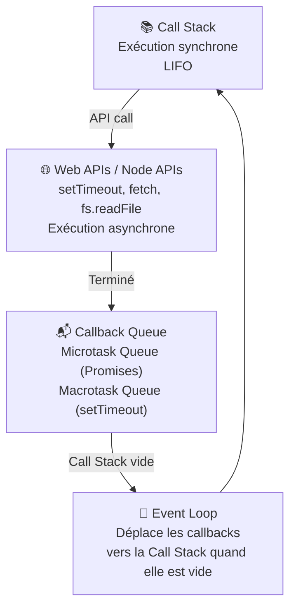
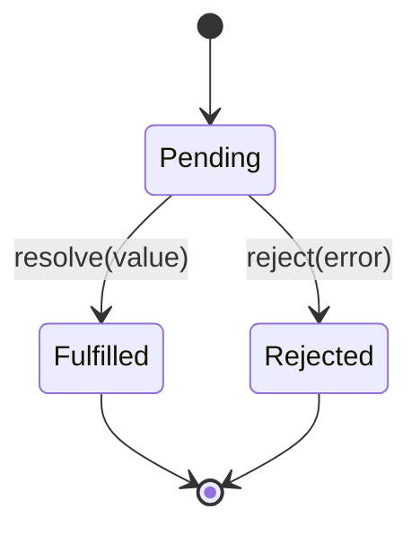

# JavaScript : Programmation Asynchrone & Promises

> **Feynman Technique** — JavaScript est comme un serveur de restaurant avec un seul garçon (single-thread). Au lieu d'attendre que la cuisine prépare une commande (bloquant), il prend les autres commandes et revient quand la cuisine sonne la cloche (callback/promise). Ainsi le restaurant ne se fige jamais.

---

## 1. Le Modèle d'Exécution JS



### Single-Thread & Non-Bloquant

```javascript
console.log('1 — Synchrone')  // exécuté immédiatement

setTimeout(() => {
  console.log('3 — Asynchrone (après 0ms !)')
}, 0)

console.log('2 — Synchrone')  // avant le setTimeout !

// Output: 1 → 2 → 3
// Même avec 0ms, setTimeout va dans la queue et attend que la stack soit vide
```

---

## 2. Callbacks (ancienne approche)

```javascript
// Lecture de fichier asynchrone (Node.js style)
function loadData(filename, callback) {
  setTimeout(() => {
    if (!filename) callback(new Error('Fichier manquant'), null)
    else           callback(null, { data: `Contenu de ${filename}` })
  }, 1000)
}

loadData('invoice.json', (err, data) => {
  if (err) return console.error(err.message)
  console.log(data)
})

// ❌ Callback Hell — difficile à lire et maintenir
loadA((err, a) => {
  loadB(a, (err, b) => {
    loadC(b, (err, c) => {
      // pyramide de la mort...
    })
  })
})
```

---

## 3. Promises

> Une **Promise** représente une valeur qui sera disponible dans le futur. Elle est soit `pending` (en attente), `fulfilled` (résolue), ou `rejected` (rejetée).



```javascript
// Créer une Promise
function fetchInvoice(id) {
  return new Promise((resolve, reject) => {
    setTimeout(() => {
      const invoices = { 'INV-001': { total: 15000, client: 'Alfa' } }
      const invoice = invoices[id]
      if (invoice) resolve(invoice)
      else         reject(new Error(`Facture ${id} introuvable`))
    }, 500)
  })
}

// Consommer une Promise
fetchInvoice('INV-001')
  .then(invoice => {
    console.log('Facture :', invoice)
    return invoice.total * 1.19  // valeur passée au then suivant
  })
  .then(total => console.log('Total TTC :', total))
  .catch(err => console.error('Erreur :', err.message))
  .finally(() => console.log('Requête terminée'))
```

### Promise.all / Promise.allSettled / Promise.race

```javascript
// Promise.all — attend TOUTES les promises (échoue si une échoue)
const [employees, invoices, accounts] = await Promise.all([
  fetchEmployees(),
  fetchInvoices(),
  fetchAccounts()
])

// Promise.allSettled — attend toutes, même si certaines échouent
const results = await Promise.allSettled([fetchA(), fetchB(), fetchC()])
results.forEach(r => {
  if (r.status === 'fulfilled') console.log('✅', r.value)
  else                          console.error('❌', r.reason)
})

// Promise.race — première qui répond gagne
const fastest = await Promise.race([api1(), api2(), api3()])

// Promise.any — première qui RÉUSSIT (ES2021)
const first = await Promise.any([api1(), api2(), api3()])
```

---

## 4. Async / Await (ES2017)

> `async/await` est du sucre syntaxique sur les Promises — même comportement, syntaxe plus lisible.

```javascript
// async transforme la fonction en retournant une Promise
async function loadDashboard(userId) {
  try {
    const user     = await fetchUser(userId)        // attend la Promise
    const invoices = await fetchUserInvoices(user.id)
    const total    = invoices.reduce((s, i) => s + i.total, 0)
    return { user, invoices, total }
  } catch (error) {
    console.error('Dashboard error:', error.message)
    throw error  // re-throw pour que l'appelant puisse gérer
  } finally {
    console.log('Dashboard chargé')
  }
}

// Top-level await (ES2022, dans les modules)
const dashboard = await loadDashboard('usr-123')

// Parallèle avec async/await
async function loadParallel() {
  const [a, b] = await Promise.all([fetchA(), fetchB()])  // ✅ parallèle
  // vs
  const a2 = await fetchA()  // ❌ séquentiel
  const b2 = await fetchB()  // attend a2 avant de démarrer
}
```

---

## 5. Fetch API

```javascript
// GET
async function getInvoices() {
  const response = await fetch('http://localhost:9000/articles?category=js-core')
  if (!response.ok) throw new Error(`HTTP ${response.status}`)
  return response.json()
}

// POST avec body
async function createEmployee(data) {
  const response = await fetch('http://localhost:9000/users', {
    method: 'POST',
    headers: {
      'Content-Type': 'application/json',
      'Authorization': `Bearer ${localStorage.getItem('token')}`
    },
    body: JSON.stringify(data)
  })
  if (!response.ok) {
    const err = await response.json()
    throw new Error(err.message ?? 'Erreur serveur')
  }
  return response.json()
}

// Abort Controller — annuler une requête
const controller = new AbortController()
setTimeout(() => controller.abort(), 5000)  // timeout 5s

const data = await fetch('/api/data', { signal: controller.signal })
  .catch(err => { if (err.name === 'AbortError') console.log('Requête annulée') })
```

---

## 6. Error Handling Patterns

```javascript
// Wrapper utilitaire — évite les try/catch répétitifs
async function safe(promise) {
  try {
    const data = await promise
    return [null, data]
  } catch (error) {
    return [error, null]
  }
}

// Usage
const [err, invoices] = await safe(fetchInvoices())
if (err) return console.error('Impossible de charger les factures')
console.log(invoices)

// Retry avec backoff exponentiel
async function withRetry(fn, maxAttempts = 3) {
  for (let attempt = 1; attempt <= maxAttempts; attempt++) {
    try {
      return await fn()
    } catch (err) {
      if (attempt === maxAttempts) throw err
      const delay = Math.pow(2, attempt) * 1000  // 2s, 4s, 8s...
      await new Promise(resolve => setTimeout(resolve, delay))
    }
  }
}
```

---

## 7. Challenges IT Domaine

### Challenge 1 — Facturation (Invoicing)
> Charger et afficher des factures depuis une API REST avec gestion d'erreur.

```javascript
async function InvoiceDashboard(apiUrl) {
  console.log('Chargement du tableau de bord...')
  const [err, data] = await safe(fetch(`${apiUrl}/articles?category=invoices`).then(r => r.json()))

  if (err) {
    console.error('Erreur de chargement:', err.message)
    return { invoices: [], total: 0 }
  }

  const invoices = data.data
  const total    = invoices.reduce((s, inv) => s + (inv.total ?? 0), 0)
  const paid     = invoices.filter(inv => inv.status === 'PAID').length

  console.log(`${invoices.length} factures — ${paid} payées — Total: ${total.toFixed(2)} TND`)
  return { invoices, total, paid }
}
```

### Challenge 2 — Paie (Payroll)
> Calcul de paie parallèle pour plusieurs employés avec Promise.all.

```javascript
async function runPayroll(employeeIds, month) {
  console.log(`Traitement paie ${month} — ${employeeIds.length} employés`)

  const results = await Promise.allSettled(
    employeeIds.map(id => calculatePaySlip(id, month))
  )

  const success = results.filter(r => r.status === 'fulfilled').map(r => r.value)
  const errors  = results.filter(r => r.status === 'rejected').map(r => r.reason.message)

  console.log(`✅ ${success.length} bulletins générés`)
  if (errors.length) console.error(`❌ ${errors.length} erreurs:`, errors)

  return { success, errors }
}
```

### Challenge 3 — Comptabilité (Accounting)
> Synchroniser les données comptables avec retry automatique.

```javascript
async function syncAccountingData(period) {
  const sync = () => fetch(`/api/accounting/sync`, {
    method: 'POST',
    headers: { 'Content-Type': 'application/json' },
    body: JSON.stringify({ period })
  }).then(r => {
    if (!r.ok) throw new Error(`Sync failed: ${r.status}`)
    return r.json()
  })

  const result = await withRetry(sync, 3)
  console.log(`Synchronisation ${period} terminée:`, result)
  return result
}
```

---

## Résumé Feynman

| Concept | Analogie |
|---------|---------|
| Callback | Laisser son numéro au médecin — il rappelle quand c'est prêt |
| Promise | Ticket de restaurant — pending jusqu'à ce que le plat soit prêt |
| async/await | Lire une history en synchrone alors qu'en dessous c'est des promises |
| Promise.all | Commander plusieurs plats à la fois — attendre que tout soit prêt |
| Event Loop | Le serveur qui vérifie en permanence s'il y a des commandes prêtes en cuisine |
| Fetch | Le livreur qui part chercher la commande et revient avec les données |
