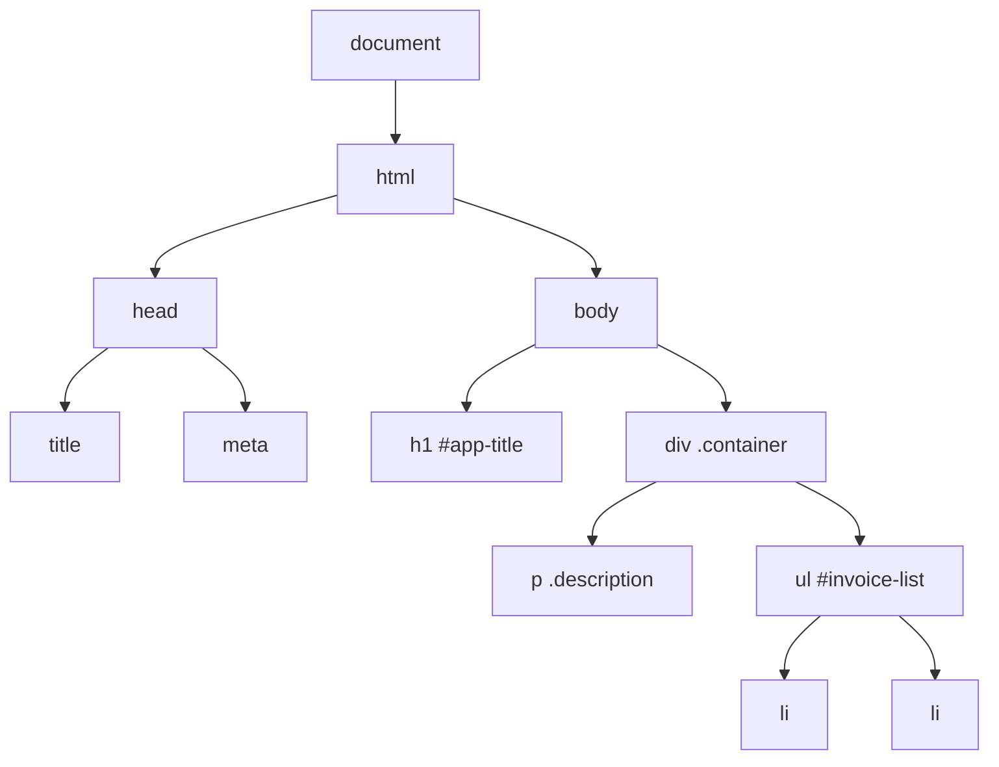
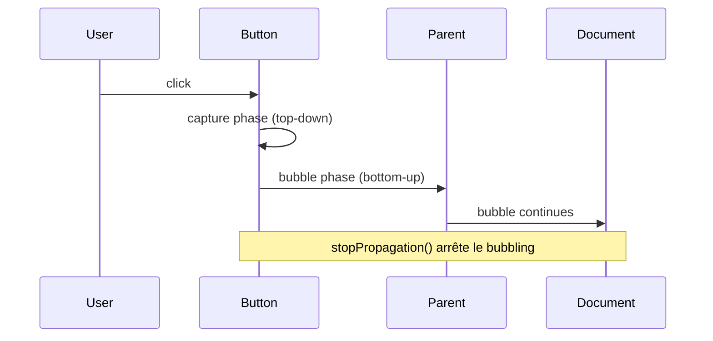

# JavaScript : DOM & BOM

> **Feynman Technique** — Le DOM (Document Object Model) c'est la carte de la page web. JavaScript peut lire cette carte, ajouter des rues (éléments), les modifier ou les supprimer. Le BOM (Browser Object Model) c'est tout ce qui entoure la page : l'URL, l'historique, les onglets, la taille de l'écran.

---

## 1. Le DOM — Modèle de Document



### Sélectionner des éléments

```javascript
// Sélecteurs modernes (retournent un Element ou null)
const title   = document.getElementById('app-title')
const btn     = document.querySelector('.btn-primary')        // premier match CSS
const items   = document.querySelectorAll('.invoice-item')    // NodeList

// Traversal
const parent   = element.parentElement
const children = element.children                             // HTMLCollection
const next     = element.nextElementSibling
const prev     = element.previousElementSibling
const firstEl  = element.firstElementChild
```

### Modifier le DOM

```javascript
// Contenu
element.textContent = 'Nouveau texte'          // texte brut (sécurisé)
element.innerHTML   = '<strong>Texte</strong>' // HTML (attention XSS !)

// Attributs
element.setAttribute('data-id', 'INV-001')
element.getAttribute('data-id')                 // 'INV-001'
element.removeAttribute('disabled')
element.dataset.id                              // accès data-* attributes

// Classes
element.classList.add('active')
element.classList.remove('hidden')
element.classList.toggle('selected')
element.classList.contains('loading')           // true/false

// Styles
element.style.color = '#2563EB'
element.style.display = 'none'
getComputedStyle(element).fontSize              // style calculé réel

// Créer et insérer des éléments
const li = document.createElement('li')
li.textContent = 'Facture INV-001'
li.classList.add('invoice-item')
ul.appendChild(li)                              // fin de ul
ul.insertBefore(li, ul.firstChild)              // début de ul
parent.insertAdjacentHTML('beforeend', '<li>...</li>')  // plus performant
```

---

## 2. Événements

```javascript
// addEventListener — méthode préconisée
button.addEventListener('click', (event) => {
  event.preventDefault()   // empêcher le comportement par défaut (ex: submit)
  event.stopPropagation()  // arrêter la remontée (bubbling)
  console.log('Clicked !', event.target)
})

// Événements courants
element.addEventListener('click', handler)
element.addEventListener('submit', handler)
element.addEventListener('input', handler)         // saisie en temps réel
element.addEventListener('change', handler)        // valeur changée (blur)
element.addEventListener('keydown', handler)
element.addEventListener('mouseover', handler)
element.addEventListener('DOMContentLoaded', handler)  // DOM prêt
window.addEventListener('load', handler)           // tout chargé

// Event Delegation — un seul listener pour de nombreux éléments
document.getElementById('invoice-list').addEventListener('click', (e) => {
  const item = e.target.closest('.invoice-item')  // bubble up
  if (!item) return
  const id = item.dataset.invoiceId
  console.log('Invoice clicked:', id)
})
```



---

## 3. Manipulation avancée du DOM

```javascript
// Template literals pour générer du HTML
function renderInvoiceCard(invoice) {
  return `
    <div class="invoice-card" data-invoice-id="${invoice.id}">
      <h3>${invoice.client}</h3>
      <span class="badge ${invoice.status === 'PAID' ? 'badge-green' : 'badge-red'}">
        ${invoice.status}
      </span>
      <p class="total">${invoice.total.toFixed(2)} TND</p>
      <button class="btn-pay" ${invoice.status === 'PAID' ? 'disabled' : ''}>
        Marquer payée
      </button>
    </div>
  `
}

// Rendu d'une liste d'invoices
function renderInvoices(invoices) {
  const container = document.getElementById('invoices-container')
  container.innerHTML = invoices.map(renderInvoiceCard).join('')
}

// Observateur de mutations (MutationObserver)
const observer = new MutationObserver((mutations) => {
  mutations.forEach(m => console.log('DOM changed:', m.type))
})
observer.observe(document.body, { childList: true, subtree: true })
```

---

## 4. Forms & Validation

```javascript
const form = document.getElementById('invoice-form')

form.addEventListener('submit', async (e) => {
  e.preventDefault()

  const data = Object.fromEntries(new FormData(form))
  // { client: 'Alfa', total: '15000', description: '...' }

  // Validation
  const errors = []
  if (!data.client.trim()) errors.push('Client requis')
  if (isNaN(+data.total) || +data.total <= 0) errors.push('Total invalide')

  if (errors.length) {
    document.getElementById('errors').innerHTML = errors.map(e => `<li>${e}</li>`).join('')
    return
  }

  try {
    const invoice = await createInvoice({ ...data, total: +data.total })
    form.reset()
    renderInvoices([invoice, ...currentInvoices])
  } catch (err) {
    console.error(err)
  }
})
```

---

## 5. BOM — Browser Object Model

```javascript
// window — objet global
window.innerWidth        // largeur de la fenêtre
window.innerHeight       // hauteur
window.scrollY           // position de défilement vertical
window.open('/report', '_blank')  // ouvrir un nouvel onglet

// location — URL et navigation
window.location.href     // URL complète
window.location.pathname // '/dashboard/invoices'
window.location.search   // '?status=PAID&year=2026'
window.location.hash     // '#section-2'
window.location.reload() // recharger la page
window.location.assign('/login')  // rediriger

// Parsing query params
const params = new URLSearchParams(window.location.search)
params.get('status')     // 'PAID'
params.getAll('tag')     // ['js', 'web']

// history
window.history.back()
window.history.forward()
window.history.pushState({ page: 1 }, '', '/invoices/1')

// localStorage & sessionStorage
localStorage.setItem('token', 'jwt-xxx')
localStorage.getItem('token')
localStorage.removeItem('token')
localStorage.clear()

// sessionStorage — effacé à la fermeture de l'onglet
sessionStorage.setItem('draft', JSON.stringify(invoiceDraft))
const draft = JSON.parse(sessionStorage.getItem('draft') ?? '{}')
```

---

## 6. Challenges IT Domaine

### Challenge 1 — Facturation (Invoicing)
> Interface CRUD de factures avec DOM vanilla.

```javascript
class InvoiceUI {
  constructor(containerId, apiClient) {
    this.container = document.getElementById(containerId)
    this.api = apiClient
    this.invoices = []
    this.init()
  }

  async init() {
    await this.load()
    this.render()
    this.attachEvents()
  }

  async load() {
    const { data } = await this.api.get('/articles?category=invoices')
    this.invoices = data
  }

  render() {
    this.container.innerHTML = this.invoices.length === 0
      ? '<p class="empty">Aucune facture</p>'
      : this.invoices.map(inv => `
          <tr data-id="${inv.id}">
            <td>${inv.slug}</td>
            <td>${inv.title}</td>
            <td class="status ${inv.tags.includes('paid') ? 'paid' : 'pending'}">
              ${inv.tags.includes('paid') ? '✅ Payée' : '⏳ En attente'}
            </td>
            <td><button class="btn-delete">Supprimer</button></td>
          </tr>`).join('')
  }

  attachEvents() {
    this.container.addEventListener('click', async (e) => {
      if (e.target.classList.contains('btn-delete')) {
        const row = e.target.closest('tr')
        const id  = row.dataset.id
        await this.api.delete(`/articles/${id}`)
        this.invoices = this.invoices.filter(inv => inv.id !== id)
        this.render()
      }
    })
  }
}
```

### Challenge 2 — Paie (Payroll)
> Formulaire de saisie de paie avec calcul en temps réel.

```javascript
// Calcul en temps réel via 'input' event
const grossInput = document.getElementById('gross-salary')

grossInput.addEventListener('input', () => {
  const gross = +grossInput.value
  if (isNaN(gross) || gross <= 0) return

  const cnss = gross * 0.09
  const irg  = (gross - cnss) * 0.25
  const net  = gross - cnss - irg

  document.getElementById('cnss-amount').textContent = cnss.toFixed(2)
  document.getElementById('irg-amount').textContent  = irg.toFixed(2)
  document.getElementById('net-salary').textContent  = net.toFixed(2)
})
```

### Challenge 3 — Comptabilité (Accounting)
> Sauvegarder un brouillon de saisie comptable dans localStorage.

```javascript
const DRAFT_KEY = 'accounting_draft'

// Restaurer depuis localStorage au chargement
window.addEventListener('DOMContentLoaded', () => {
  const draft = JSON.parse(localStorage.getItem(DRAFT_KEY) ?? '{}')
  if (draft.account) document.getElementById('account').value = draft.account
  if (draft.amount)  document.getElementById('amount').value  = draft.amount
  if (draft.label)   document.getElementById('label').value   = draft.label
})

// Sauvegarder à chaque modification
document.querySelectorAll('#journal-form input, #journal-form select')
  .forEach(el => {
    el.addEventListener('input', () => {
      const draft = Object.fromEntries(new FormData(document.getElementById('journal-form')))
      localStorage.setItem(DRAFT_KEY, JSON.stringify(draft))
    })
  })

// Effacer le brouillon après soumission
document.getElementById('journal-form').addEventListener('submit', () => {
  localStorage.removeItem(DRAFT_KEY)
})
```

---

## Résumé Feynman

| Concept | Analogie |
|---------|---------|
| DOM | Carte interactive de la page — JS peut l'annoter et la modifier |
| Event Listener | Gardien de sécurité — observe et réagit quand quelque chose se passe |
| Event Bubbling | Caillou jeté dans l'eau — les ondes remontent du centre vers le bord |
| Event Delegation | Un seul vigile surveille toute la salle au lieu d'un par table |
| localStorage | Cahier de notes persistant — reste même si on ferme le navigateur |
| sessionStorage | Post-it sur l'écran — disparaît quand on ferme l'onglet |
| BOM | La cabine de pilotage autour de la page (URL, historique, taille écran) |
