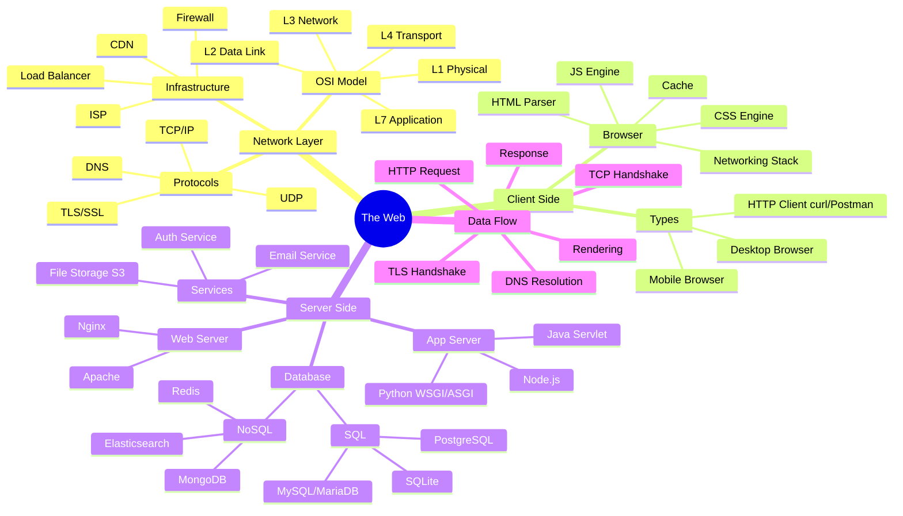
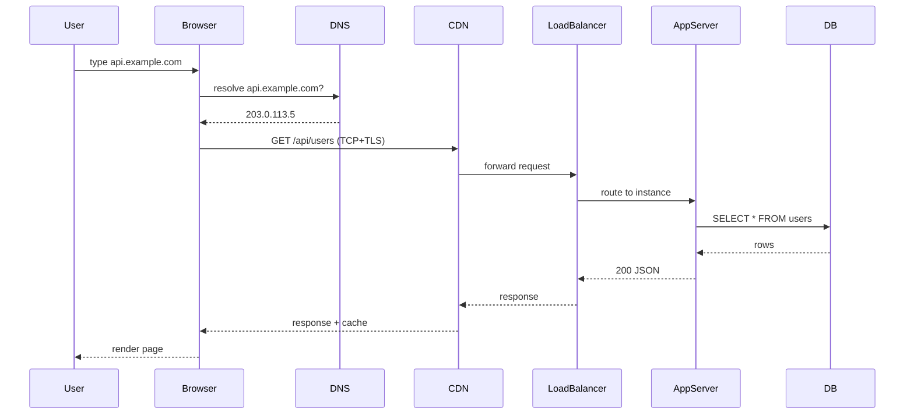
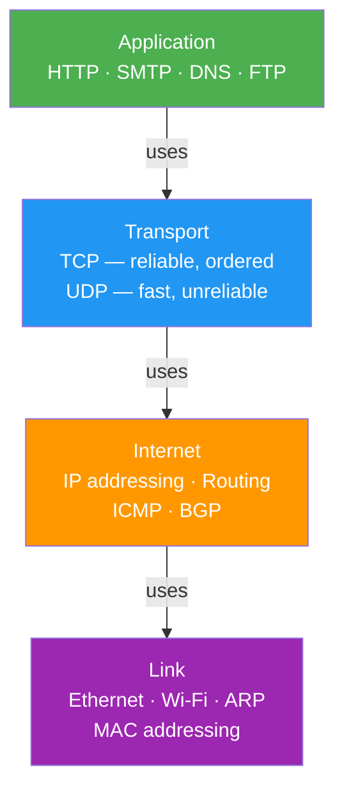
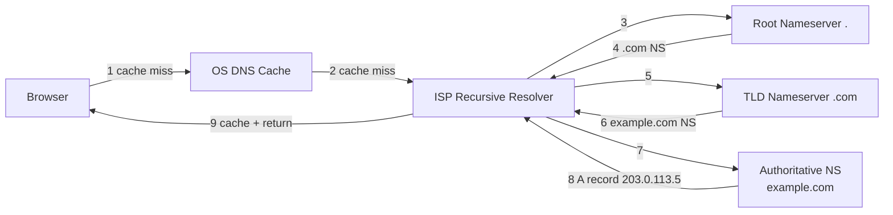
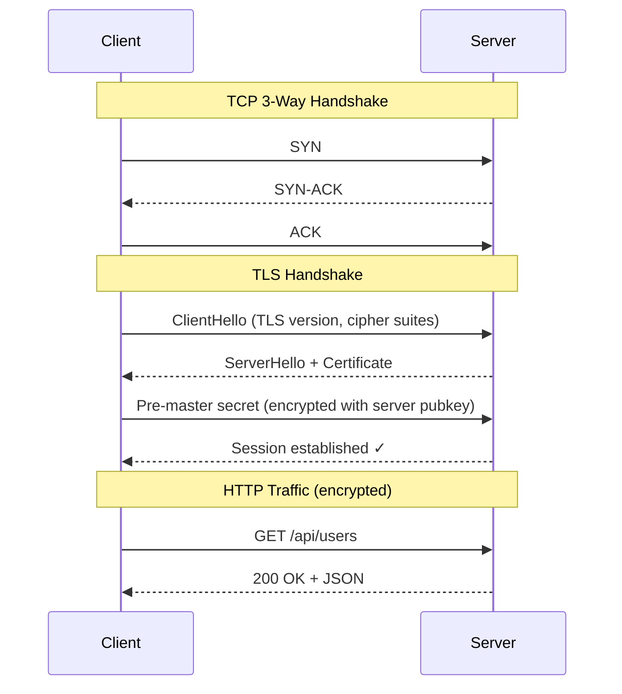
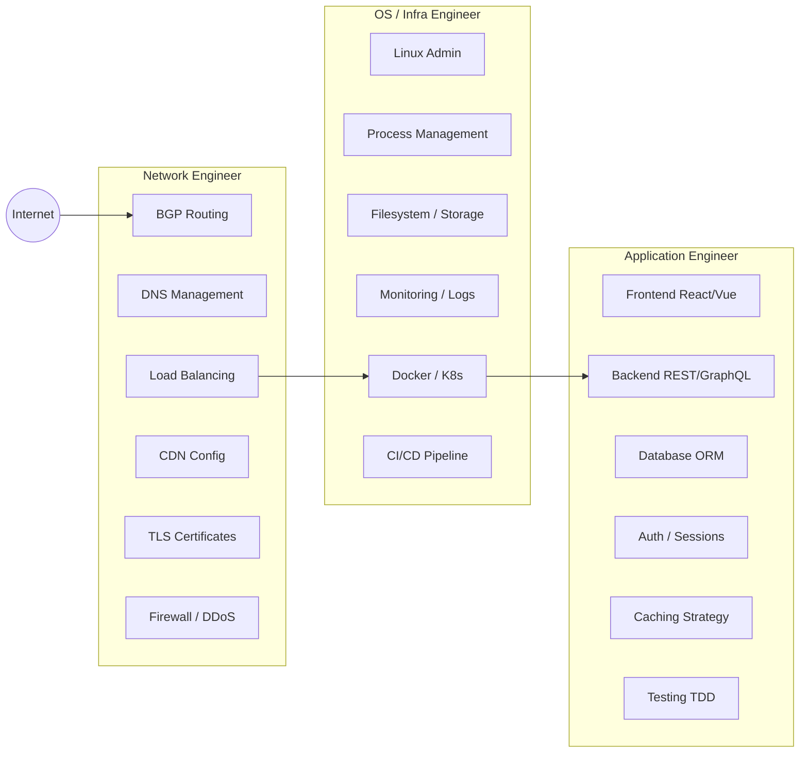

# Mind Map: How the Web Works

## Full Architecture View

```mermaid
mindmap
  root((The Web))
    Network Layer
      OSI Model
        L7 Application
        L4 Transport
        L3 Network
        L2 Data Link
        L1 Physical
      Protocols
        TCP/IP
        UDP
        DNS
        TLS/SSL
      Infrastructure
        ISP
        CDN
        Load Balancer
        Firewall
    Client Side
      Browser
        HTML Parser
        CSS Engine
        JS Engine
        Networking Stack
        Cache
      Types
        Desktop Browser
        Mobile Browser
        HTTP Client curl/Postman
    Server Side
      Web Server
        Nginx
        Apache
      App Server
        Node.js
        Python WSGI/ASGI
        Java Servlet
      Database
        SQL
          PostgreSQL
          MySQL/MariaDB
          SQLite
        NoSQL
          MongoDB
          Redis
          Elasticsearch
      Services
        Auth Service
        Email Service
        File Storage S3
    Data Flow
      DNS Resolution
      TCP Handshake
      TLS Handshake
      HTTP Request
      Response
      Rendering
```

## Request Lifecycle (Sequence)

```mermaid
sequenceDiagram
  participant User
  participant Browser
  participant DNS
  participant CDN
  participant LoadBalancer
  participant AppServer
  participant DB

  User->>Browser: type api.example.com
  Browser->>DNS: resolve api.example.com?
  DNS-->>Browser: 203.0.113.5

  Browser->>CDN: GET /api/users (TCP+TLS)
  CDN->>LoadBalancer: forward request
  LoadBalancer->>AppServer: route to instance
  AppServer->>DB: SELECT * FROM users
  DB-->>AppServer: rows
  AppServer-->>LoadBalancer: 200 JSON
  LoadBalancer-->>CDN: response
  CDN-->>Browser: response + cache
  Browser-->>User: render page
```

## TCP/IP Stack

```mermaid
graph TD
    A[Application<br/>HTTP · SMTP · DNS · FTP] -->|uses| B
    B[Transport<br/>TCP — reliable, ordered<br/>UDP — fast, unreliable] -->|uses| C
    C[Internet<br/>IP addressing · Routing<br/>ICMP · BGP] -->|uses| D
    D[Link<br/>Ethernet · Wi-Fi · ARP<br/>MAC addressing]

    style A fill:#4CAF50,color:#fff
    style B fill:#2196F3,color:#fff
    style C fill:#FF9800,color:#fff
    style D fill:#9C27B0,color:#fff
```

## DNS Resolution

```mermaid
flowchart LR
    Browser -->|1 cache miss| OS_Cache[OS DNS Cache]
    OS_Cache -->|2 cache miss| Resolver[ISP Recursive Resolver]
    Resolver -->|3| Root[Root Nameserver .]
    Root -->|4 .com NS| Resolver
    Resolver -->|5| TLD[TLD Nameserver .com]
    TLD -->|6 example.com NS| Resolver
    Resolver -->|7| Auth[Authoritative NS<br/>example.com]
    Auth -->|8 A record 203.0.113.5| Resolver
    Resolver -->|9 cache + return| Browser
```

## HTTP/HTTPS Handshake

```mermaid
sequenceDiagram
  participant C as Client
  participant S as Server

  Note over C,S: TCP 3-Way Handshake
  C->>S: SYN
  S-->>C: SYN-ACK
  C->>S: ACK

  Note over C,S: TLS Handshake
  C->>S: ClientHello (TLS version, cipher suites)
  S-->>C: ServerHello + Certificate
  C->>S: Pre-master secret (encrypted with server pubkey)
  S-->>C: Session established ✓

  Note over C,S: HTTP Traffic (encrypted)
  C->>S: GET /api/users
  S-->>C: 200 OK + JSON
```

## Web Roles (Engineer Perspectives)

```mermaid
graph LR
    subgraph "Network Engineer"
        NE1[BGP Routing]
        NE2[DNS Management]
        NE3[Load Balancing]
        NE4[CDN Config]
        NE5[TLS Certificates]
        NE6[Firewall / DDoS]
    end

    subgraph "OS / Infra Engineer"
        OE1[Linux Admin]
        OE2[Process Management]
        OE3[Filesystem / Storage]
        OE4[Monitoring / Logs]
        OE5[Docker / K8s]
        OE6[CI/CD Pipeline]
    end

    subgraph "Application Engineer"
        AE1[Frontend React/Vue]
        AE2[Backend REST/GraphQL]
        AE3[Database ORM]
        AE4[Auth / Sessions]
        AE5[Caching Strategy]
        AE6[Testing TDD]
    end

    Internet((Internet)) --> NE1
    NE3 --> OE5
    OE5 --> AE2
```
