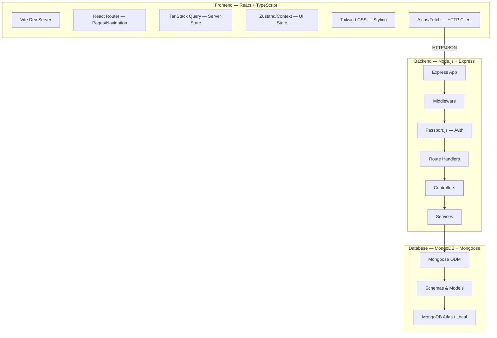
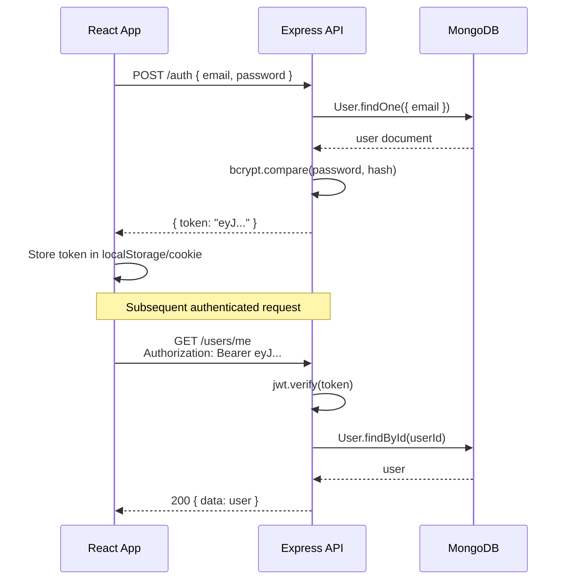
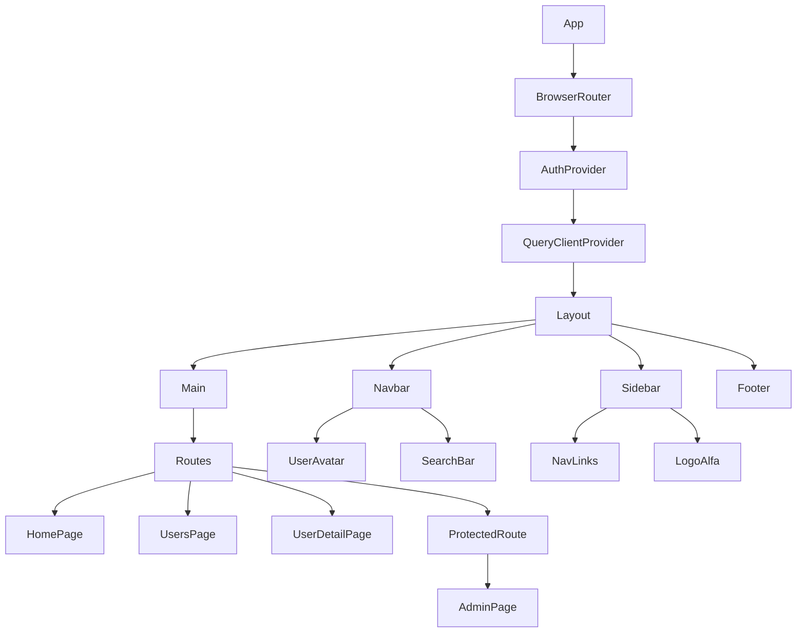
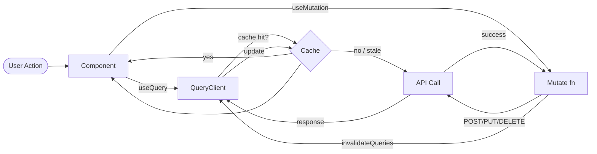
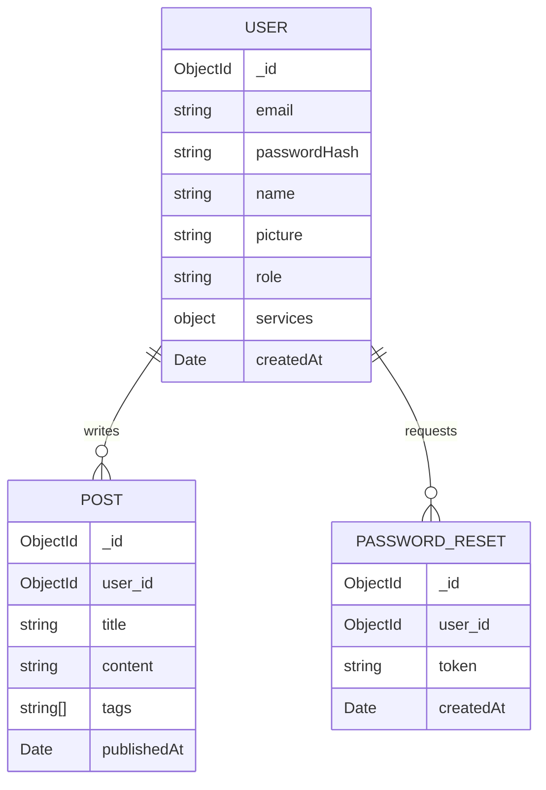
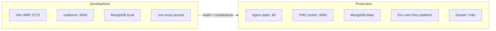

# Mind Map: MERN Stack Architecture

## Stack Layers

```mermaid
graph TD
    subgraph "Frontend — React + TypeScript"
        FE1[Vite Dev Server]
        FE2[React Router — Pages/Navigation]
        FE3[TanStack Query — Server State]
        FE4[Zustand/Context — UI State]
        FE5[Tailwind CSS — Styling]
        FE6[Axios/Fetch — HTTP Client]
    end

    subgraph "Backend — Node.js + Express"
        BE1[Express App]
        BE2[Passport.js — Auth]
        BE3[Route Handlers]
        BE4[Controllers]
        BE5[Services]
        BE6[Middleware]
    end

    subgraph "Database — MongoDB + Mongoose"
        DB1[Mongoose ODM]
        DB2[Schemas & Models]
        DB3[MongoDB Atlas / Local]
    end

    FE6 -->|HTTP/JSON| BE1
    BE1 --> BE6 --> BE2 --> BE3
    BE3 --> BE4 --> BE5 --> DB1
    DB1 --> DB2 --> DB3
```

## Auth Flow

```mermaid
sequenceDiagram
  participant FE as React App
  participant BE as Express API
  participant DB as MongoDB

  FE->>BE: POST /auth { email, password }
  BE->>DB: User.findOne({ email })
  DB-->>BE: user document
  BE->>BE: bcrypt.compare(password, hash)
  BE-->>FE: { token: "eyJ..." }
  FE->>FE: Store token in localStorage/cookie

  Note over FE,BE: Subsequent authenticated request
  FE->>BE: GET /users/me<br/>Authorization: Bearer eyJ...
  BE->>BE: jwt.verify(token)
  BE->>DB: User.findById(userId)
  DB-->>BE: user
  BE-->>FE: 200 { data: user }
```

## React Component Tree

```mermaid
graph TD
    App --> BrowserRouter
    BrowserRouter --> AuthProvider
    AuthProvider --> QueryClientProvider
    QueryClientProvider --> Layout

    Layout --> Navbar
    Layout --> Sidebar
    Layout --> Main
    Layout --> Footer

    Main --> Routes
    Routes --> HomePage
    Routes --> UsersPage
    Routes --> UserDetailPage
    Routes --> ProtectedRoute

    ProtectedRoute --> AdminPage

    Navbar --> UserAvatar
    Navbar --> SearchBar
    Sidebar --> NavLinks
    Sidebar --> LogoAlfa
```

## Data Flow with TanStack Query

```mermaid
flowchart LR
    User([User Action]) --> Component
    Component --> |useQuery| QueryClient
    QueryClient --> |cache hit?| Cache{Cache}
    Cache --> |yes| Component
    Cache --> |no / stale| API[API Call]
    API --> |response| QueryClient
    QueryClient --> |update| Cache
    Cache --> Component

    Component --> |useMutation| Mutation[Mutate fn]
    Mutation --> |POST/PUT/DELETE| API
    API --> |success| Mutation
    Mutation --> |invalidateQueries| QueryClient
```

## MongoDB Document Model

```mermaid
erDiagram
    USER {
        ObjectId _id
        string email
        string passwordHash
        string name
        string picture
        string role
        object services
        Date createdAt
    }
    POST {
        ObjectId _id
        ObjectId user_id
        string title
        string content
        string[] tags
        Date publishedAt
    }
    PASSWORD_RESET {
        ObjectId _id
        ObjectId user_id
        string token
        Date createdAt
    }

    USER ||--o{ POST : "writes"
    USER ||--o{ PASSWORD_RESET : "requests"
```

## Development vs Production

```mermaid
graph LR
    subgraph DEV ["Development"]
        D1[Vite HMR :5173]
        D2[nodemon :9000]
        D3[MongoDB local]
        D4[.env local secrets]
    end

    subgraph PROD ["Production"]
        P1[Nginx static :80]
        P2[PM2 cluster :9000]
        P3[MongoDB Atlas]
        P4[Env vars from platform]
        P5[Docker / K8s]
    end

    DEV -->|build + containerize| PROD
```
