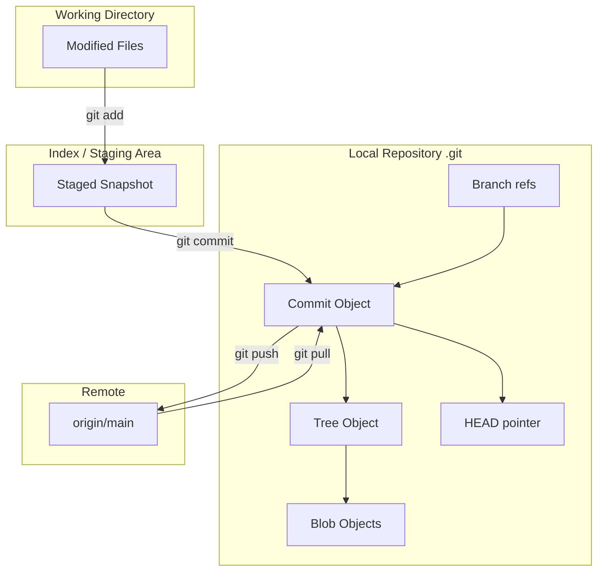
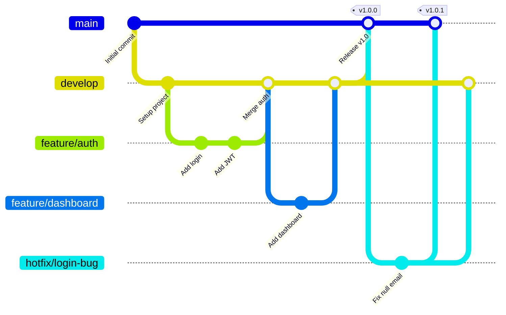
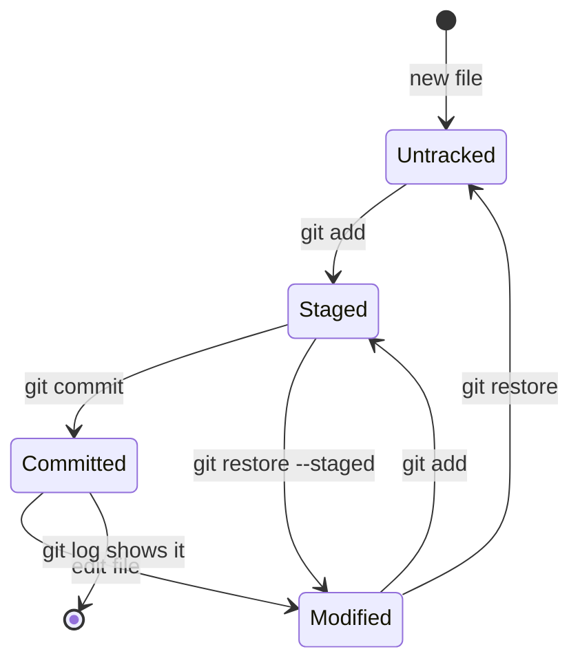
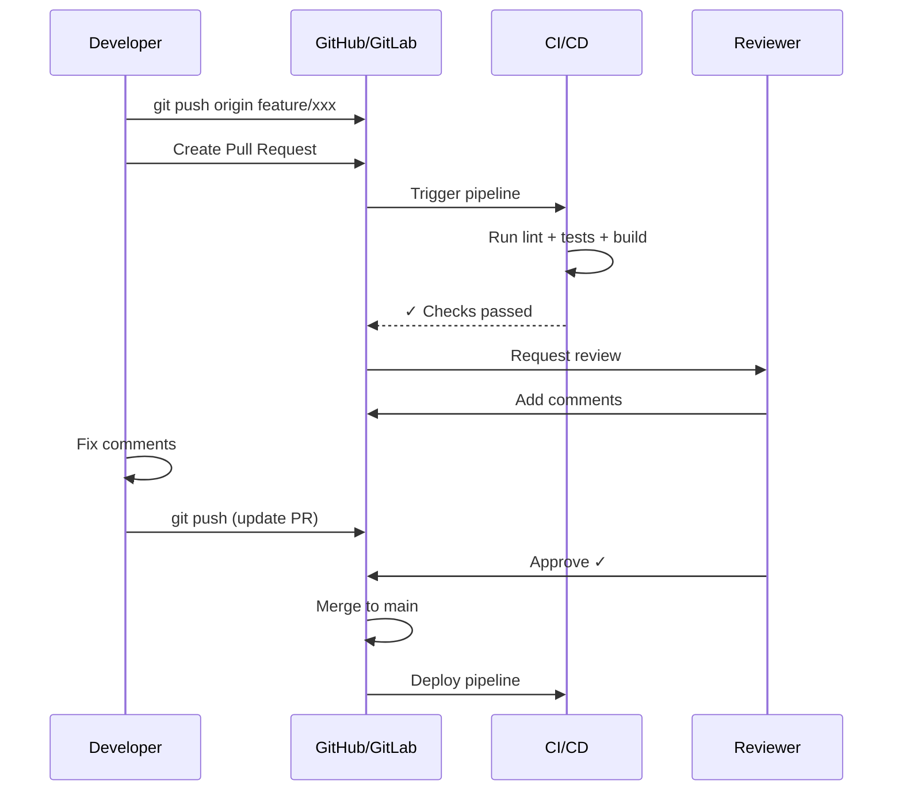
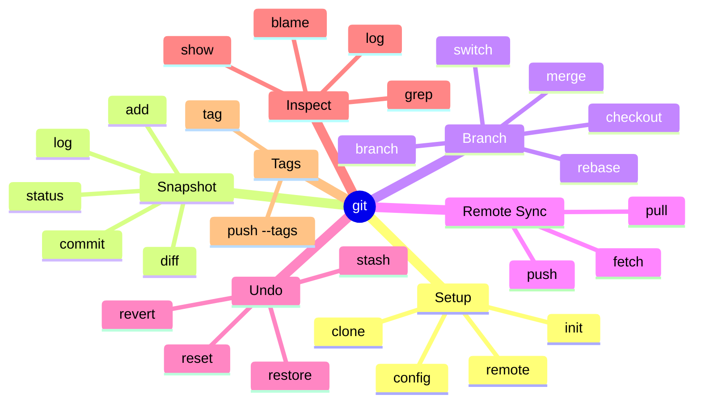
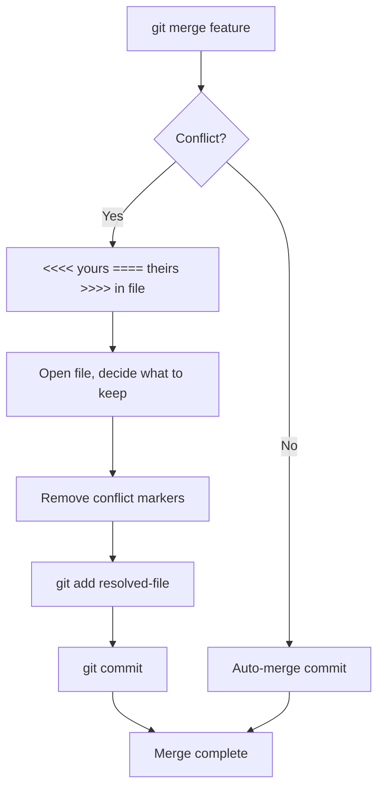

# Mind Map: Git Workflow & Version Control

## Git Object Model

## Branching Strategy (Git Flow)

## Git Commit Lifecycle

## Pull Request / Code Review Flow

## Git Commands Mindmap

## Conflict Resolution Workflow

