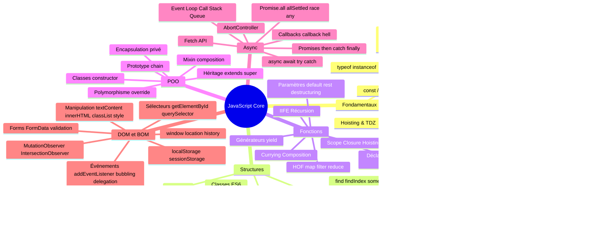
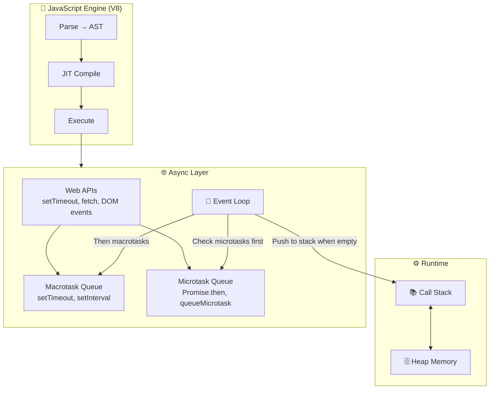
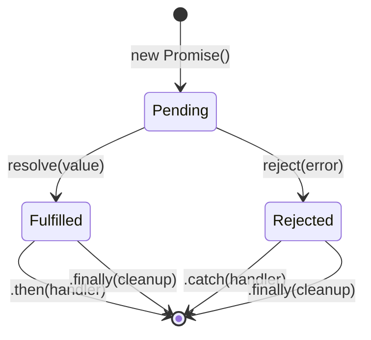
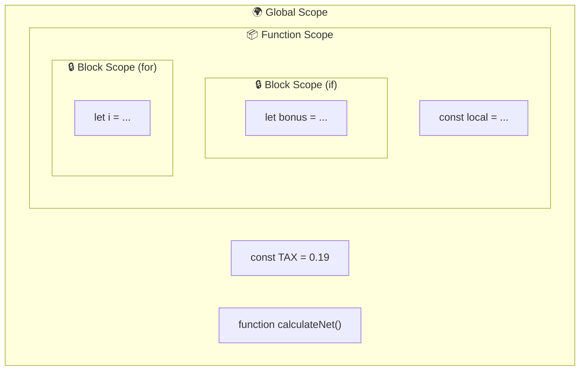
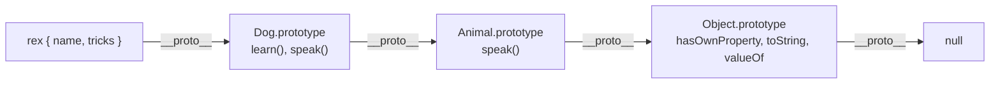
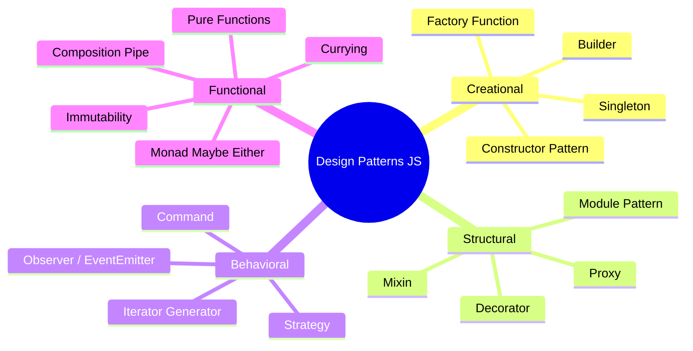
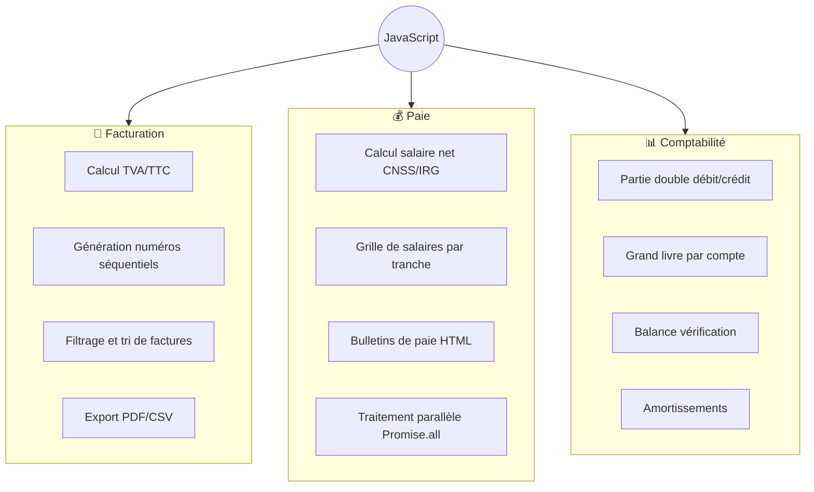
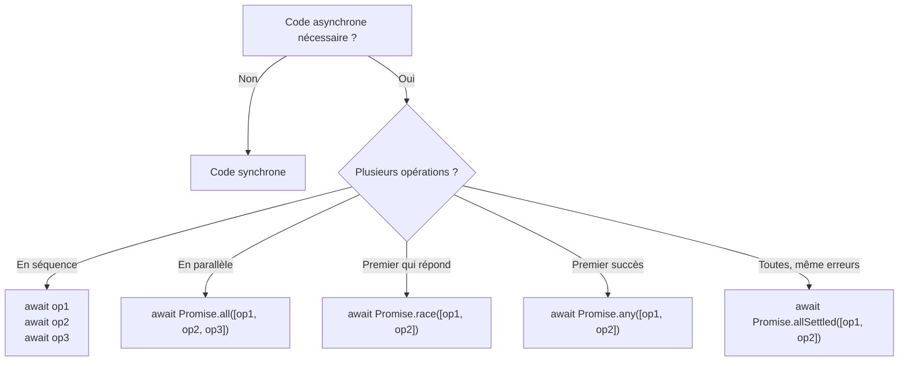

# JavaScript Core — Mind Map

---

## Vue d'ensemble

---

## Flux d'exécution JavaScript

---

## Cycle de vie d'une Promise

---

## Hiérarchie de Portée (Scope)

---

## Chaîne de Prototypes (Prototype Chain)

---

## Patterns Architecturaux

---

## Techniques IT par Domaine

---

## Async / Await — Decision Tree

