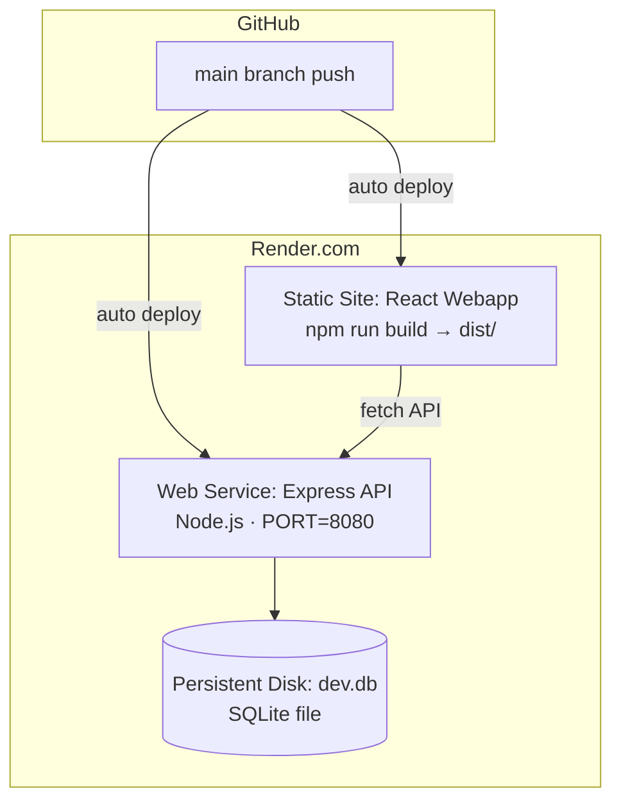

# Sprint 02 — CI/CD Deploy to Render.com

**Project**: MyGreenCardToJob  
**GitHub Repo**: (to be wired — see step 1)  
**Target platform**: Render.com (free tier: Web Service + Static Site)

---

## Architecture on Render



---

## Sub-Sprints

### SS-2.1 — GitHub Setup (15 min)
- [ ] `git init` in project root (or confirm existing)
- [ ] Create `.gitignore` at root (node_modules, *.db, .env, dist)
- [ ] Push to GitHub repo `MyGreenCardToJob`
- [ ] Protect `main` branch (require PR to merge)

### SS-2.2 — Backend: Render Web Service (30 min)

**render.yaml (backend)**:
```yaml
services:
  - type: web
    name: mygreencard-api
    runtime: node
    rootDir: backend
    buildCommand: npm install && npx prisma generate && npx prisma migrate deploy
    startCommand: node src/index.js
    envVars:
      - key: NODE_ENV
        value: production
      - key: DATABASE_URL
        value: file:/data/prod.db
      - key: JWT_SECRET
        generateValue: true
      - key: MASTER_KEY
        generateValue: true
      - key: SENDGRID_KEY
        sync: false
    disk:
      name: sqlite-data
      mountPath: /data
      sizeGB: 1
```

**Required env vars to set in Render dashboard**:
- `SENDGRID_KEY` (manual)
- `DATABASE_URL=file:/data/prod.db`
- `NODE_ENV=production`

### SS-2.3 — Frontend: Render Static Site (20 min)

**render.yaml (webapp)**:
```yaml
  - type: web
    name: mygreencard-webapp
    runtime: static
    rootDir: webapp
    buildCommand: npm install && npm run build
    staticPublishPath: dist
    envVars:
      - key: VITE_API_URL
        value: https://mygreencard-api.onrender.com
    headers:
      - path: /*
        name: Cache-Control
        value: no-cache
    routes:
      - type: rewrite
        source: /*
        destination: /index.html
```

### SS-2.4 — GitHub Actions CI (30 min)

**.github/workflows/ci.yml**:
```yaml
name: CI

on:
  push:
    branches: [main, develop]
  pull_request:
    branches: [main]

jobs:
  backend:
    runs-on: ubuntu-latest
    defaults:
      run:
        working-directory: backend
    steps:
      - uses: actions/checkout@v4
      - uses: actions/setup-node@v4
        with: { node-version: '20', cache: npm, cache-dependency-path: backend/package-lock.json }
      - run: npm ci
      - run: npx prisma generate
      - run: DATABASE_URL=file:./test.db npx prisma migrate deploy
      - run: npm test
        env:
          DATABASE_URL: file:./test.db
          MASTER_KEY: testkey
          JWT_SECRET: testsecret
          SENDGRID_KEY: testkey
          NODE_ENV: test

  webapp:
    runs-on: ubuntu-latest
    defaults:
      run:
        working-directory: webapp
    steps:
      - uses: actions/checkout@v4
      - uses: actions/setup-node@v4
        with: { node-version: '20', cache: npm, cache-dependency-path: webapp/package-lock.json }
      - run: npm ci
      - run: npm run build
```

### SS-2.5 — Root render.yaml (Blueprint deploy)

Create `render.yaml` at project root so Render auto-provisions both services from one file.

**Execution order**:
1. Push to GitHub (SS-2.1)
2. Create render.yaml (SS-2.5)
3. Connect Render dashboard → "New Blueprint" → point to repo
4. Set secret env vars in Render dashboard
5. Set up GitHub Actions (SS-2.4)
6. Verify: push to main → CI passes → both services deploy

---

## Notes on SQLite on Render

- SQLite needs a **Persistent Disk** (Render Starter plan ~$7/mo) to survive deploys
- Free tier: no persistent disk → db resets on each deploy
- **Free tier workaround**: run `npm run db:seed` as part of the build command to repopulate on each deploy (training content is idempotent via upsert ✓)
- For production with user data: migrate to **PostgreSQL** (Render free tier available)

## Future migration path to PostgreSQL

When user accounts need persistence beyond restarts:
1. Install `@prisma/client` + `pg` driver
2. Change schema `provider = "postgresql"`
3. Update `DATABASE_URL` to Render's Postgres connection string
4. Run migrations

---

## Checklist Before Deploy

- [ ] All secrets out of code (`.env` git-ignored ✓)
- [ ] `prisma/migrations/` committed to git ✓
- [ ] `npm run build` passes locally ✓
- [ ] Backend `/articles` responds correctly ✓
- [ ] `VITE_API_URL` points to production API URL
- [ ] SPA routing: `/* → /index.html` rewrite in render.yaml ✓
