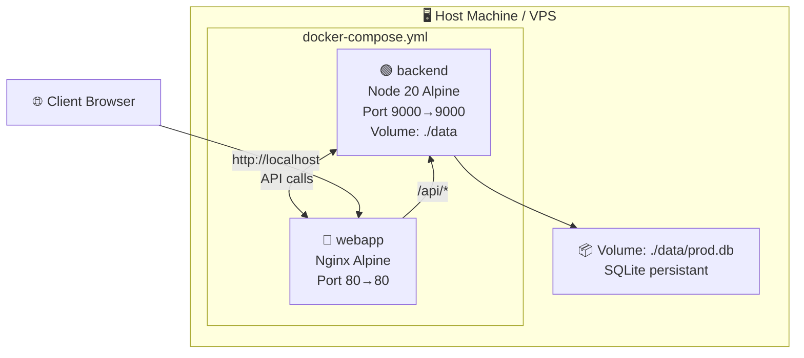

# Sprint 03 — Containerisation Docker

**Projet**: MyGreenCardToJob — Formation Web Engineer  
**Objectif**: Containeriser le backend (Express+SQLite) et le frontend (Vite React) pour un déploiement reproductible sur n'importe quelle machine ou VPS.

---

## Architecture Docker



---

## Sub-Sprints

### SS-3.1 — Dockerfile Backend (30 min)

**backend/Dockerfile**:
```dockerfile
# ── Build stage ──────────────────────────────────────────────────────────────
FROM node:20-alpine AS builder
WORKDIR /app
COPY package*.json ./
RUN npm ci --omit=dev
COPY . .
RUN npx prisma generate

# ── Runtime stage ─────────────────────────────────────────────────────────────
FROM node:20-alpine AS runtime
WORKDIR /app
ENV NODE_ENV=production
COPY --from=builder /app/node_modules ./node_modules
COPY --from=builder /app/src ./src
COPY --from=builder /app/prisma ./prisma
COPY --from=builder /app/package.json ./
COPY --from=builder /app/.babelrc ./

RUN mkdir -p /data
ENV DATABASE_URL=file:/data/prod.db

EXPOSE 9000
CMD ["sh", "-c", "npx prisma migrate deploy && node prisma/seed.js && node src/index.js"]
```

**Vérification locale**:
```bash
cd backend
docker build -t mygreencard-api .
docker run -p 9000:9000 \
  -e JWT_SECRET=devsecret \
  -e MASTER_KEY=devmasterkey \
  -e SENDGRID_KEY=placeholder \
  -v $(pwd)/data:/data \
  mygreencard-api
```

### SS-3.2 — Dockerfile Frontend (20 min)

**webapp/Dockerfile**:
```dockerfile
# ── Build stage ──────────────────────────────────────────────────────────────
FROM node:20-alpine AS builder
WORKDIR /app
COPY package*.json ./
RUN npm ci
COPY . .
ARG VITE_API_URL=http://localhost:9000
ENV VITE_API_URL=$VITE_API_URL
RUN npm run build

# ── Runtime stage (nginx) ─────────────────────────────────────────────────────
FROM nginx:alpine AS runtime
COPY --from=builder /app/dist /usr/share/nginx/html
COPY nginx.conf /etc/nginx/conf.d/default.conf
EXPOSE 80
CMD ["nginx", "-g", "daemon off;"]
```

**webapp/nginx.conf**:
```nginx
server {
    listen 80;
    root /usr/share/nginx/html;
    index index.html;

    # SPA routing — fallback to index.html
    location / {
        try_files $uri $uri/ /index.html;
    }

    # Cache assets agressivement
    location /assets/ {
        expires 1y;
        add_header Cache-Control "public, immutable";
    }

    # Proxy API vers le backend
    location /api/ {
        proxy_pass http://backend:9000/;
        proxy_set_header Host $host;
        proxy_set_header X-Real-IP $remote_addr;
    }
}
```

### SS-3.3 — Docker Compose (20 min)

**docker-compose.yml** (à la racine du projet):
```yaml
version: '3.9'

services:
  backend:
    build:
      context: ./backend
      dockerfile: Dockerfile
    container_name: mygreencard-api
    restart: unless-stopped
    ports:
      - "9000:9000"
    environment:
      NODE_ENV: production
      DATABASE_URL: file:/data/prod.db
      JWT_SECRET: ${JWT_SECRET}
      MASTER_KEY: ${MASTER_KEY}
      SENDGRID_KEY: ${SENDGRID_KEY:-placeholder}
    volumes:
      - ./data:/data
    healthcheck:
      test: ["CMD", "wget", "-qO-", "http://localhost:9000/articles"]
      interval: 30s
      timeout: 10s
      retries: 3

  webapp:
    build:
      context: ./webapp
      dockerfile: Dockerfile
      args:
        VITE_API_URL: ${VITE_API_URL:-http://localhost:9000}
    container_name: mygreencard-webapp
    restart: unless-stopped
    ports:
      - "80:80"
    depends_on:
      backend:
        condition: service_healthy

volumes: {}
```

**`.env.docker`** (à committer, sans secrets):
```env
JWT_SECRET=change_me_in_production
MASTER_KEY=change_me_in_production
SENDGRID_KEY=placeholder
VITE_API_URL=http://localhost:9000
```

**Commandes**:
```bash
# Démarrer
docker-compose --env-file .env.docker up --build -d

# Logs
docker-compose logs -f backend
docker-compose logs -f webapp

# Arrêter
docker-compose down

# Nettoyer tout
docker-compose down -v --rmi all
```

### SS-3.4 — .dockerignore (10 min)

**backend/.dockerignore**:
```
node_modules
*.db
.env
*.log
coverage/
dist/
```

**webapp/.dockerignore**:
```
node_modules
dist/
.env
*.log
```

### SS-3.5 — GitHub Actions: Build & Push to Docker Hub (30 min)

**.github/workflows/docker.yml**:
```yaml
name: Docker Build & Push

on:
  push:
    branches: [main]
    tags: ['v*']

jobs:
  build-and-push:
    runs-on: ubuntu-latest
    steps:
      - uses: actions/checkout@v4

      - name: Log in to Docker Hub
        uses: docker/login-action@v3
        with:
          username: ${{ secrets.DOCKER_USERNAME }}
          password: ${{ secrets.DOCKER_TOKEN }}

      - name: Build & push backend
        uses: docker/build-push-action@v5
        with:
          context: ./backend
          push: true
          tags: |
            ${{ secrets.DOCKER_USERNAME }}/mygreencard-api:latest
            ${{ secrets.DOCKER_USERNAME }}/mygreencard-api:${{ github.sha }}

      - name: Build & push webapp
        uses: docker/build-push-action@v5
        with:
          context: ./webapp
          push: true
          build-args: |
            VITE_API_URL=https://mygreencard-api.onrender.com
          tags: |
            ${{ secrets.DOCKER_USERNAME }}/mygreencard-webapp:latest
            ${{ secrets.DOCKER_USERNAME }}/mygreencard-webapp:${{ github.sha }}
```

**Secrets à configurer dans GitHub**:
- `DOCKER_USERNAME`
- `DOCKER_TOKEN` (Docker Hub access token)

### SS-3.6 — Déploiement VPS (30 min)

Sur le VPS (Ubuntu 22.04 recommandé):
```bash
# 1. Installer Docker + Compose
curl -fsSL https://get.docker.com | sh
sudo usermod -aG docker $USER
newgrp docker

# 2. Cloner le projet
git clone https://github.com/your-org/MyGreenCardToJob.git
cd MyGreenCardToJob

# 3. Configurer les variables d'env
cp .env.docker .env.prod
nano .env.prod  # modifier les secrets

# 4. Démarrer
docker-compose --env-file .env.prod up -d

# 5. Vérifier
curl http://localhost:9000/articles
curl http://localhost/
```

---

## Notes & Bonnes Pratiques

| Pratique | Raison |
|----------|--------|
| Multi-stage builds | Réduire la taille de l'image (node_modules dev exclus du runtime) |
| `node:20-alpine` | Image minimale (~5MB vs ~900MB pour node:20) |
| Healthcheck | docker-compose attend que l'API soit prête avant de démarrer le frontend |
| Volume `/data` | Persiste la base SQLite entre les redémarrages de container |
| `.env.docker` | Template de configuration sans secrets — safe à committer |
| Secrets via env vars | Jamais hardcodés dans le Dockerfile ou le code |

---

## Checklist

- [x] `backend/Dockerfile` créé (multi-stage, Node 20 Alpine)
- [x] `webapp/Dockerfile` créé (multi-stage, Nginx Alpine)
- [x] `webapp/nginx.conf` configuré (SPA routing + proxy `/api/*` → backend)
- [x] `docker-compose.yml` à la racine créé (healthcheck, volume SQLite)
- [x] `.dockerignore` dans backend/ et webapp/
- [x] `.env.docker` template créé (sans secrets)
- [x] `vite.config.ts` mis à jour — proxy dev `/api` → localhost:9000
- [x] `webapp/src/api/client.ts` mis à jour — BASE = `/api` par défaut
- [x] `.github/workflows/docker.yml` créé (build + push Docker Hub, GHA cache)
- [ ] `docker-compose up --build` testé end-to-end (nécessite Docker Desktop actif)
- [ ] Secrets Docker Hub configurés dans GitHub (`DOCKER_USERNAME`, `DOCKER_TOKEN`)
- [ ] Push vers Docker Hub réussi en CI
- [ ] Déploiement VPS vérifié

---

## Migration future : Kubernetes

Quand la charge justifie l'orchestration :
1. Convertir `docker-compose.yml` → manifests Kubernetes (kompose)
2. Déployer sur un cluster K3s (VPS léger) ou AKS/EKS/GKE
3. Utiliser PostgreSQL (CrunchiDB ou RDS) à la place de SQLite
4. Configurer Ingress NGINX + cert-manager (TLS auto)
